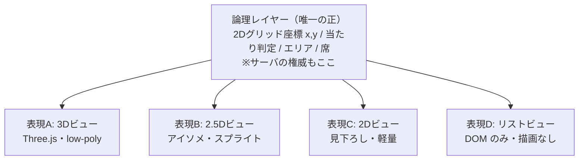
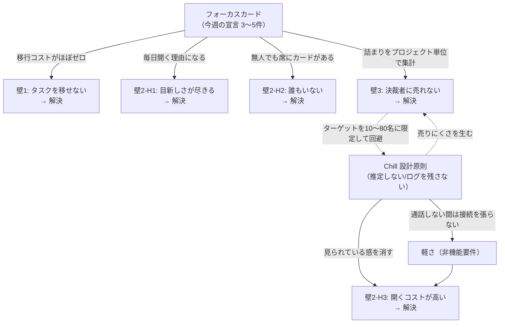

# 02. 問題解決 — 6つの壁

**このドキュメントが、この設計の中心である。**

ここには2種類の壁がある。

- **Part 1（壁1〜3）**: [01. 既存プロダクト調査](./01-market-research.md) から見えた壁。
  先行プロダクトが撤退・停滞した原因と考えられるもの。**プロダクトが定着しない**種類の壁。
- **Part 2（壁4〜6）**: 実際に会社で働いている人から挙がった壁。
  **プロダクトが良くても導入されずに終わる**種類の壁。

どちらも、埋めないまま実装に入れば同じ結末になる。
[03. 機能要件](./03-features.md) 以降の設計判断は、すべてここでの解を実装に落としたものである。

> **前提の明示**: 以降は「ゼロから作る」（[01](./01-market-research.md) の選択肢B）を前提に書いている。
> ただし [06. ロードマップ](./06-roadmap.md) の Phase 0 で WorkAdventure(OSS) のセルフホストを実測し、
> 「作るコスト」を確定させてから Phase 1 に入る構成にしてある。方針を A に切り替える判断点を残してある。

---

# Part 1 — 市場調査から見えた3つの壁

## 壁1: タスク管理は「移せない」

### 問題の再定義

バーチャルオフィスは Zoom より気軽に導入できる。会議の習慣を壊さないからだ。
一方タスク管理は、Jira / Linear / Asana / Notion / Backlog に
**既にデータと運用ルールと過去の履歴が乗っている**。

先行プロダクトが揃って「連携」に逃げた（SoWork の Slack / Zapier 連携、Roam のタスク機能なし）のは、
統合に技術的な困難があったからではなく、**移行を要求した瞬間に導入が止まる**からである。

つまり本当の問題はこう書ける:

> 「タスク管理も付いています」では誰も移らない。
> かといって既存ツールを全同期すると、連携の維持コストだけが残り、統合の意味が消える。

### 解: 置き換えない。**上に薄い層を1枚だけ載せる**

本プロダクトが持つタスクデータは、原則として **「今週やると本人が宣言した3〜5件」だけ** にする。
これを **フォーカスカード** と呼ぶ。

```
┌─ フォーカスカード（山田 / 2026-W37）──────────┐
│ ◻ 決済APIのリトライ設計を書く      → PROJ-412  │
│ ◻ 新人のオンボード資料を1章だけ                │
│ ◻ 請求バッチの原因調査（詰まってる）  ⚠ 3日    │
└────────────────────────────────────────────────┘
```

- 1項目は **既存ツールのチケットURLでもよいし、ただのテキストでもよい**
- Jira の全チケットを同期**しない**。**同期しないことが機能である**
- 移行コストは実質ゼロ。月曜の朝に3行書くだけ
- 既存の PM ツールは、そのまま今まで通り使ってもらう

### なぜこれで「統合する意味」が出るのか

フォーカスカードは、**空間があるからこそ価値が出る形**にする。
逆に言えば、空間が無ければ意味のないタスク表示にする。

| 空間の出来事 | フォーカスカードの振る舞い |
| --- | --- |
| アバターに近づく | その人の今週の宣言が吹き出しで見える。**「今なにやってるんですか?」を聞かなくて済む** |
| 会議室に入る | 参加者全員のカードが横に並ぶ。議題を思い出す装置になる |
| 会話が終わる | 「この会話から項目を足しますか?」を1度だけ提案（拒否すれば二度と出ない） |
| 3日以上動いていない項目 | **その人ではなくプロジェクトに**「詰まり」として表示（→ 壁3の解と接続） |

これが [01](./01-market-research.md) で書いた **「タスクを空間の関数にする」** の具体形である。
Jira を空間に貼り付けたのではなく、空間でしか成立しない情報の出し方をしている。

### 段階的に太らせる余地は残す

フォーカスカードだけでは足りないチームのために、
プロジェクト単位のカンバン（[03. 機能要件](./03-features.md)）も持つ。
ただし **Phase 2 で作るのはフォーカスカードが先、カンバンは後**。
順序を逆にすると「劣化版 Jira」になり、移行コストの壁に正面衝突する。

### 外部連携の方針

| やること | やらないこと |
| --- | --- |
| チケットURLを貼ると、タイトルとステータスだけ取得して表示（OGP 相当の読み取り） | 双方向同期 |
| フォーカスカードのエクスポート（Markdown / CSV） | Jira のイシューを本プロダクトから作成・更新 |
| Webhook で「詰まり」を Slack に流す（任意） | Slack のメッセージを取り込む |

読み取り専用・片方向に限定する。維持コストが跳ね上がるのは常に双方向同期である。

---

## 壁2: 数週間で開かなくなる（定着率）

### 問題の分解

「飽きる」は原因ではなく症状なので、3つの仮説に分ける。

| 仮説 | 内容 | 効く対策の性質 |
| --- | --- | --- |
| **H1: 目新しさが尽きる** | アバターを動かす楽しさは有限。2週間で尽きる | 空間以外に開く理由が要る |
| **H2: 開いても誰もいない** | クリティカルマスを割ると加速度的に死ぬ。「誰もいない広場」は二度と開かれない | 無人時の価値が要る |
| **H3: 開いていること自体のコストが高い** | 見られている感、PCの重さ、バッテリー | 圧とリソースを下げる |

先行プロダクトはH1に対して「空間をもっと楽しく」（装飾、ゲーム部屋、アバターカスタマイズ）で応じた。
これは効かない。楽しさの追加は、楽しさの減衰を遅らせるだけで止められない。

### H1 の解: 空間を目的にしない。**毎日の起点をフォーカスカードにする**

- **朝1分の習慣**をプロダクトの中心に置く: ログイン → 今週の宣言を確認・更新 → そのままフロアに立つ
- 空間は「開く理由」ではなく「開いた結果いる場所」にする
- 通知は1日1回、朝の穏やかなリマインドのみ（[00. 原則4](./00-overview.md) と整合）

タスクを統合する本当の理由はここにある。**タスクは毎日開かれるが、空間は毎日は開かれない。**

### H2 の解: **無人の空間を作らない（非同期の痕跡）**

誰もいない時間に来た人が、何も無い部屋を見て閉じる — これを構造的に潰す。

- フロアには、その日の各メンバーの **フォーカスカードが席に置かれている**（本人が居なくても）
- 直近の会話があった場所に「さっきここで話していた」という淡い痕跡を残す（誰が、は出さない。時間帯のみ）
- 会議室には次の予約が表示される

さらに運用として **チェックイン時刻の合意**（例: 平日10:00に全員がカードを更新する）を推奨し、
プロダクトはそれを支える最小限の機能だけ持つ（時刻設定と、1日1回のリマインド）。
**強制はしない。強制した瞬間に壁3に転落する。**

### H3 の解: 圧とリソースの両方を下げる

**圧**: [00. 原則2・原則3](./00-overview.md) がそのまま対策になっている。
ステータスを推定しない、在席ログを残さない、稼働ダッシュボードを作らない。

**リソース**: 常時開きっぱなしにされる前提の非機能要件を置く。
これは「Chill」を技術要件に翻訳したもので、[04. アーキテクチャ](./04-architecture.md) で担保する。

| 項目 | 目標値 |
| --- | --- |
| 非アクティブタブでのCPU使用率 | 実質0（描画停止、位置同期を10Hz → 0.2Hz に落とす） |
| アクティブ・非通話時のCPU使用率 | ノートPCで5%未満 |
| 通話していない間のメディア接続 | **張らない**（LiveKit room に入らない） |
| アイドル時の上り帯域 | 10 kbps 未満 |

「タブを1日中開いていてもファンが回らない」は、このプロダクトでは機能である。

### 測定するもの / しないもの

| KPI にする | KPI にしない（原則3に反する） |
| --- | --- |
| フォーカスカードの週次更新率 | 個人の空間滞在時間 |
| 会議室**外**での会話セッション比率 | 個人のオンライン時間 |
| 会話セッションの長さの中央値（10分未満が目標） | 個人の発話量・レスポンス速度 |
| 週3日以上ログインする人の割合（組織全体の集計値） | 個人別のログイン履歴 |

左列はすべて **個人を特定しない集計値** として算出する。実装上の担保は [05. データモデル](./05-data-model.md)。

---

## 壁3: 「監視しません」は決裁者に売れない

### 問題

「稼働ログを取りません」「分析ダッシュボードを作りません」は、
**使う人には刺さるが、買う人（管理職・経営）には機能の欠如に見える**。
先行プロダクトが揃ってプレゼンス可視化と稼働分析を売りにしているのは、そこに予算があるからである。

### 解1: ターゲットで回避する

[00. Overview](./00-overview.md) のターゲットを 10〜80名に置いているのは、この壁が理由である。
この規模では **決裁者自身が日々の利用者** であり、「監視されたくない」と「状況を把握したい」が同一人物の中にある。
矛盾が組織間の対立ではなく、個人の中のトレードオフになる。だから解ける。

**逆に言えば、数百名以上の組織に売りに行く時点でこの設計は破綻する。** それは意図的な非ターゲットである。

### 解2: 管理者が本当に欲しい情報を、個人を出さずに与える

管理者が「稼働率」を見たがるのは、稼働率が知りたいからではない。
**「何が止まっているか」を知りたいのに、それを直接知る手段がないから代理指標を見ている。**

ならば代理指標を捨てて、本体を直接出す。

```
┌─ 詰まり（今週）────────────────────────────┐
│ 請求システム刷新    3件が3日以上動いていない │
│ モバイル対応        1件が「ブロック中」      │
│                                              │
│ ※ 担当者名は表示されません                  │
└──────────────────────────────────────────────┘
```

- 単位は **プロジェクト**。個人ではない
- 出すのは「詰まっている項目の数と、詰まっている日数」だけ
- クリックすると項目の内容は見えるが、**誰がやっているかは出さない**
- 「誰か手が空いている人」ではなく「**この項目、誰か知ってる人いる?**」という声のかけ方を促す UI にする

これは監視ではなく **ブロッカー検出** である。管理者の意思決定に必要な情報を満たしつつ、個人の稼働は一切出さない。

### 解3: 「記録しないもの」を製品の約束として明示する

- 設定画面に **「このプロダクトが記録しないもの」** の常設ページを置く（隠しページにしない）
- そこに列挙した項目は、[05. データモデル](./05-data-model.md) の「作らないテーブル」リストと1対1で対応させる
- 管理者ロールであっても、そこに書かれた情報にアクセスするAPIが**存在しない**ようにする

「設定でオフにできます」ではなく「**そもそも保存していません**」にする。
前者は「オンにできる」ということであり、圧は消えない。

---

---

# Part 2 — 現場から挙がった3つの導入障壁

Part 1 は市場調査から見えた壁だった。
Part 2 は **実際に会社で働いている人から挙がった** 壁である。
こちらのほうが具体的で、しかも **プロダクトが良くても導入できずに終わる** 種類の壁なので、
Part 1 と同等かそれ以上に重い。

| # | 現場の声 | 本質 |
| --- | --- | --- |
| 壁4 | 「安全面が心配」 | 情報システム部門のセキュリティ審査を通らない |
| 壁5 | 「回線的にそもそも導入できない」 | 企業ネットワークが WebRTC/WebSocket を通さない、帯域が足りない |
| 壁6 | 「会社のポンコツPCで3D描画はキツい」 | 業務端末の性能で動かない（**3D を採用したうえで越える**） |

---

## 壁4: セキュリティ審査を通らない

### 何が起きるか

新しい SaaS を、しかも **音声・映像を扱い、社内の会話が乗るもの**を入れようとすると、情シス審査で止まる。実際に問われるのは:

1. データはどこに保存されるか（国外に出ないか）
2. SOC 2 / ISO 27001 を持っているか
3. **常時マイクにアクセスするのか**（盗聴されないと言い切れるか）
4. SSO は必須にできるか。退職者を即座に遮断できるか
5. 端末に何かインストールする必要があるか
6. 通信先はどこか。ファイアウォールに何を許可すればいいか
7. **監査ログは取れるか** ← ここが本プロダクトと正面衝突する

### 解1: ブラウザのみ・インストール不要（最大の武器）

管理者権限を要求しない。EXE を配らない。エージェントを常駐させない。
これだけで審査の難所がいくつか消える。ネイティブアプリを作らないという判断（[03. Won't](./03-features.md)）は、
UX上の妥協ではなく **導入可能性のための設計** である。

### 解2: 「使っていない間はマイクを掴んでいない」を構造で示す

ここが本プロダクトの最も強い回答になる。

[04. §5.2](./04-architecture.md) で採用した **「room = 会話単位」** の設計により、
**通話していない間は `getUserMedia()` を呼んでいない**。つまり:

> ブラウザのタブに表示されるマイク使用インジケータが、**通話中だけ点灯し、それ以外は消えている。**
> OS のマイク使用表示も同じ。**利用者自身の目で、盗聴していないことを毎日確認できる。**

「弊社は盗聴しません」という約束ではなく、**OS とブラウザが第三者として証明してくれる状態**を作る。
審査の場でこれを実演できることの重さは大きい。

競合の多くは「常時接続してミュートで待機」する方式で、この証明ができない。

### 解3: セルフホスト可能な構成にする

構成要素をすべて OSS で揃えてある（[04. §2](./04-architecture.md)）:
Next.js / Node / PostgreSQL / Redis / LiveKit / coturn。**すべて自社 VPC やオンプレに置ける。**

- データレジデンシーの問題が消える（社内から出ない）
- 「サブプロセッサが誰か」という質問自体が消える
- 壁5（回線）の解にも同時になる（後述）

Gather も ovice も SaaS 専用である。**セルフホスト可能であることは、この市場で明確な差別化になる。**

### 解4: 監査ログの衝突を、境界線を引いて解く（重要）

[00. 原則3](./00-overview.md) の「在席ログを残さない」は、情シスの「監査ログを取れ」と真っ向から衝突する。
ここを曖昧にすると、どちらの要求も満たせない中途半端なものになる。**明確に線を引く。**

| 残すもの（監査に必要） | 残さないもの（監視に使える） |
| --- | --- |
| ログイン成功・失敗（誰が、いつ、どのIPから） | 誰がどのフロアのどこに何分いたか |
| 管理操作（メンバー追加削除、権限変更、設定変更） | 誰と誰が何分話したか |
| データのエクスポート実行 | 個人のオンライン時間・稼働率 |
| プライベートルームの**作成・招待**の事実 | プライベートルームの**中で何が起きたか** |
| アクセス権限の変更履歴 | 発話量、レスポンス速度、既読 |

**説明の仕方**: 「ログがありません」ではなく
「**セキュリティ監査に必要なログはすべてあります。従業員の監視に使えるログはありません**」と言う。
情シスが本当に欲しいのは前者であり、後者を求めているのは（もしいるなら）情シスではない。

この境界線を **「監査ログ仕様書」** として文書化し、審査時に提出できる状態にしておく。

### 解5: 審査提出パッケージを最初から用意する

審査が長引く最大の原因は「聞かれてから調べる」ことである。以下を Phase 1 の成果物に含める。

- 通信先ドメイン・IPレンジ・ポートの一覧（許可リストにコピペできる形式）
- データフロー図（何がどこを通り、どこに保存されるか）
- 保存データ一覧と保持期間、削除ポリシー
- 暗号化方式（転送時・保存時）
- サブプロセッサ一覧（セルフホスト時は「なし」）
- 権限要求の一覧と、それぞれが必要になるタイミング

### 解6: 権限を最小に、要求タイミングを遅く

| 権限 | いつ要求するか |
| --- | --- |
| マイク | **会話を開始する瞬間**（着席・ノック承認）。それ以外では一切要求しない |
| カメラ | **会議室に入り、ビデオを ON にした瞬間**。既定は OFF |
| 画面共有 | 明示的に共有ボタンを押した瞬間 |
| 通知 | 初回は要求しない。ユーザーが通知設定を開いたときに初めて |

さらに、**録画・文字起こしを作らない**（[03. Won't](./03-features.md)）ことは、
情報漏洩リスクを減らすという意味でセキュリティ上の強みでもある。
「録画データの管理」という審査項目が丸ごと消える。

### 解7: 通信経路の安全性を、経路ごとに説明できる状態にする

「暗号化しています」では審査は通らない。**どの経路で誰が中身を見られるか**を1つずつ示す。
詳細は [07. 接続の安全性](./07-security.md) に分離した。要点のみ:

- **TURN リレーは中身を見られない**（DTLS-SRTP は端点で終端する）。誤解されやすいので明示する
- **SFU だけが唯一、復号できる**。ここに3つ重ねる:
  **①音声は E2EE を既定 ON**（録画・文字起こしを作らないので代償がほぼない）、
  **②セルフホストなら復号するのは自社のサーバ**、
  **③プライベートルームは E2EE 強制**
- **P2P にしなかったので、参加者同士に IP アドレスが渡らない**（在宅勤務者の自宅 IP が同僚に見えない）
- 限界も明記する（メタデータは隠せない、ブラウザ E2EE は配信 JS に依存する）。
  **審査で信頼を失うのは、限界を隠したときである**

---

## 壁5: 回線でそもそも導入できない

### 何が起きるか

| 症状 | 原因 |
| --- | --- |
| 通話が繋がらない | **UDP がファイアウォールで塞がれている**（WebRTC の既定は UDP） |
| 接続がすぐ切れる | Proxy / SSL インスペクションが WebSocket を切っている |
| 音が途切れる | 支店から本社へ VPN 集約する構成で、全社員のトラフィックが1本に集まっている |
| そもそも繋がらない | 新規ドメインがブロックリストに入っている |
| 遅延が大きい | VPN 経由で一度センターを経由してから外に出ている |

### 解1: TURN over TCP/443 を「オプション」ではなく必須構成にする

- coturn を **TCP/443（TURNS）** で必ず立てる（[04. §8](./04-architecture.md)）
- UDP が一切通らない環境でも、HTTPS と同じポート・同じ見た目で通る
- 品質は落ちる（遅延が増える）が、**繋がらないより遥かによい**
- ここを省略すると、一定割合の顧客環境で「まったく動かない」が発生する。**削ってはいけない構成要素**

### 解2: 使うポートとドメインを極限まで絞る

- WebSocket は **wss (443) のみ**。独自ポートを使わない
- 接続先ドメインを固定・最小化する。CDN や解析 SaaS を安易に増やさない
- 目標: **情シスが許可リストに追加する行数を5行以内に収める**

導入のしやすさは、機能ではなく「許可リストの行数」で決まることがある。

### 解3: 事前診断ツール（プリフライトチェック）

導入前に **「あなたの会社のネットワークで動くか」を1クリックで判定する公開ページ**を提供する。

```
┌─ 接続診断結果 ─────────────────────────────┐
│ ✅ HTTPS (443)              到達            │
│ ✅ WebSocket (wss)          到達 / 安定      │
│ ❌ UDP (WebRTC 直接)        ブロック         │
│ ✅ TURN over TCP/443        到達  → 利用可能 │
│ ⚠  往復遅延                 180ms（やや高い）│
│ ✅ 推定利用可能帯域         12 Mbps          │
│                                              │
│ 判定: 利用可能です（TURN 経由で動作します）  │
│ [情シス向けレポートをPDFで出力]              │
└──────────────────────────────────────────────┘
```

- 営業・導入時の摩擦が劇的に減る（「試したら動かなかった」を事前に潰せる）
- **出力される PDF がそのまま情シスへの説明資料になる**（壁4の解5と接続）
- 実装コストは小さいのに効果が大きい。**Phase 1 の成果物に含める**

### 解4: 段階的縮退（グレースフルデグレード）

回線が細くても「まったく使えない」にしない。上から順に落としていく。

| 段階 | 内容 | 1人あたり帯域 |
| --- | --- | --- |
| フル | ビデオ ON の会議 | ~600 kbps |
| **既定** | **音声のみ（ビデオは会議室で明示ONした時だけ）** | **~40 kbps** |
| 低帯域 | Opus を低ビットレートに（16kbps）、位置同期を 10Hz→3Hz | ~20 kbps |
| **テキストモード** | **空間・カード・チャットのみ。通話は既存の Zoom/Teams に任せる** | **~5 kbps** |

最下段が効く。**通話ができない環境でも、フォーカスカードとチャットは使える。**
[Part 1 壁1](#壁1-タスク管理は移せない) でフォーカスカードを中核に据えたので、
**通話機能を丸ごと捨ててもプロダクトが成立する。** これは設計の副産物だが、非常に大きい。

### 解5: セルフホストで回線問題そのものを消す

壁4の解3と同じ手が、ここでも効く。
社内ネットワーク内にサーバを置けば、**トラフィックがインターネットに出ない**。
支店→センター集約の構成でも、センターにサーバがあれば外向き帯域を消費しない。

### 解6: 帯域見積もりを、情シスが計算できる形で公開する

```
100人の組織 / 平均20%が同時通話 = 20人
  アイドル 80人 × 10 kbps  =  0.8 Mbps
  通話中   20人 × 40 kbps  =  0.8 Mbps
  ────────────────────────────────────
  合計                     ≒  1.6 Mbps
```

「ビデオ会議ツール」という言葉から想像される帯域より1桁小さいことを、数字で示す。
既定でビデオ OFF という設計が、そのまま説得材料になる。

---

## 壁6: 会社のポンコツPCで動かない

> **設計変更（本節は方針転換を含む）**: 当初は「3D を作らない」を解としていた。
> しかし **3D の見た目は本プロダクトが目指す体験の一部** であるという判断により、
> **3D を採用したうえで壁6 を越える** 方針に変更した。以下はその設計である。

### 6.0 まず事実確認: Gather は 2D である

目標として挙がった Gather (gather.town) は、**2D の見下ろし型ピクセルアート**である。3D ではない。
このカテゴリで 2D が主流なのは、まさに壁6 が理由である（国内の 3D 系である RISA などは、
その分だけ動作要件が重い）。

つまり **「Gather のような体験」と「3D」は別々の要求** であり、分けて考える必要がある。
Gather の魅力の実体は、立体感ではなく次のものである。

- 自分の分身が空間内に「居る」こと
- 距離と位置に意味があること（近い＝話せる、あの部屋＝会議中）
- 誰がどこにいるかが一目で分かること

**これらは 2D でも 3D でも成立する。** そのうえで 3D を選ぶ理由は「そのほうが良いと感じるから」であり、
それは正当な理由である。ただし **代償は端末性能** であり、それが壁6 そのものである。

以降は、**3D を採りつつ壁6 を越える**方法を設計する。

### 6.1 中核となる設計: 論理レイヤーと表現レイヤーを分離する

これが壁6 と 3D を両立させる鍵である。



- **座標系は 2D グリッドのまま**（x, y と向き）。3D は「表現」に過ぎず、論理には影響しない
- サーバが持つのも、同期するのも、当たり判定も、すべて 2D グリッド
  → [04 §4](./04-architecture.md) の位置同期（tick 10Hz + AOI）は**一切変わらない**。帯域も変わらない
- 表現レイヤーだけを端末性能に応じて差し替える

**この分離をしないと、3D 化は「縮退できない一本道」になる。** 分離しておけば、
3D が動かない端末に対して 2D やリストへ落とすことができ、壁6 の縮退経路が維持される。
逆に言えば、**この分離が実装できないなら 3D は採用すべきではない。**

### 6.2 想定する最低スペック（ここを外すと全部が机上の空論になる）

```
Core i5-8250U 相当 / 内蔵GPU (Intel UHD 620) / メモリ 8GB / Windows 11 / Chrome
かつ Excel・Teams・ブラウザのタブ 15個が同時に開いている状態
```

| 指標 | 目標値 |
| --- | --- |
| フレームレート | **30fps 上限**（60fps は目指さない） |
| CPU 使用率（アクティブ・非通話） | 10% 未満 |
| CPU 使用率（非アクティブタブ） | 実質 0 |
| タブのメモリ使用量 | **350MB 以内**（3D 化に伴い 200MB から緩和） |
| ドローコール | **100 未満** |
| 三角形数 | **150k 未満** |
| テクスチャ総量 | **64MB 未満** |

**60fps を目指さない**のが要点である。アバターがグリッド上を歩く表現に 60fps は要らない。
30fps 上限にするだけで GPU/CPU 負荷はおよそ半分になる。

### 6.3 「3D は重い」の正体を分解する

3D が重くなる原因はポリゴン数ではない。実際に効くのは次の順である。

| 要因 | 影響 | 本プロダクトの方針 |
| --- | --- | --- |
| **ポストエフェクト**（Bloom / SSAO / 被写界深度） | 極大 | **一切使わない** |
| **動的シャドウ** | 大 | **使わない**。接地感は円形のブロブシャドウ（板ポリ）で出す |
| **動的ライティング** | 大 | **使わない**。ライティングはすべて**事前ベイク**（ライトマップ） |
| **ドローコール数** | 大 | 家具・壁は **インスタンシング**でまとめる。目標 100 未満 |
| **スキニングアニメーション**（骨アニメ） | 中 | アバターのみ。低ボーン数。遠距離は静止 or ビルボード |
| **内部解像度** | 中〜大 | **解像度スケーリング**（後述）。ここが最も効く調整つまみ |
| **透明・半透明の重なり** | 中 | 極力使わない |
| ポリゴン数そのもの | 小 | low-poly なら気にしなくてよい |

上から4つを全部やらないだけで、内蔵GPU でも 30fps は現実的な目標になる。
**「low-poly・ベイク済み・影なし・エフェクトなし・固定カメラ」の 3D は、想像よりずっと軽い。**

### 6.4 解1: 解像度スケーリング（最も効く低スペ対策）

3D の負荷はピクセル数にほぼ比例する。したがって **内部解像度を落として描画し、拡大して表示する**。

| 品質 | 内部解像度 | 体感 |
| --- | --- | --- |
| 標準 | 1.0x | くっきり |
| 中 | 0.75x | わずかに甘い |
| 低 | **0.5x** | 甘いが**負荷は約1/4**。十分に見られる |

- フレームタイムを監視し、**内部解像度だけを自動調整する**（見た目の要素は消さない）
- 解像度の調整は「機能を削る」わけではないため、ユーザーの選択を伴わずに動かしてよい
  （[00. 原則2](./00-overview.md)「推定しない」はユーザーの状態についての規範であり、描画品質には適用しない）

### 6.5 解2: 4段階の縮退

§6.1 の分離があるので、表現を丸ごと差し替えられる。

| モード | 内容 | 想定環境 |
| --- | --- | --- |
| **3D 標準** | Three.js、low-poly、ベイク済みライティング、影なし、30fps、解像度 1.0x | 一般的な業務PC |
| **3D 低品質** | 解像度 0.5x、アニメーション削減、遠景カリング強化、15fps | 非力な内蔵GPU |
| **2D ビュー** | **同じ論理データを見下ろしスプライトで描画**（Canvas2D）。3D を完全に捨てる | WebGL 不可、VDI、古いドライバ |
| **リストモード** | **空間描画なし。**メンバー一覧＋フォーカスカード＋チャットの DOM 表示のみ | 極端に非力な環境、モバイル |

**下2段が壁6 の生命線である。** ここでも
[Part 1 壁1](#壁1-タスク管理は移せない) でフォーカスカードを中核に据えた設計が効いている。
空間の見た目を丸ごと捨ててもプロダクトの価値が残る。空間が主役なら、この縮退は不可能だった。

> **3D を採用しても、3D を必須にはしない。** これが本節の結論である。

### 6.6 解3: VDI・リモートデスクトップを明示的に想定する

見落とされがちだが、業務PCが **VDI（仮想デスクトップ）** であることは珍しくない。
**VDI は 3D にとって最も厳しい環境である。**

- GPU が無く、WebGL がソフトウェアレンダリングになる（あるいは使えない）
  → **§6.5 の「2D ビュー」への自動フォールバックが必須**
- 画面全体が動画として転送されるため、**常時再描画が回線を食う**（壁6 が壁5 に転移する）
  → **静止時は再描画しない**。誰も動いていないフレームでは描画をスキップする
  → 3D はカメラが少しでも動くと全画面が変化するため、**カメラを固定する**設計が効く（§6.7）

「動きがないときは1ピクセルも描き変えない」を実装方針として明記する。

### 6.7 解4: カメラを固定する（性能・体験・実装のすべてに効く）

自由に回転・ズームできる3Dカメラにしない。**斜め見下ろしの固定アングル**（クォータービュー）にする。

| 効果 | 内容 |
| --- | --- |
| 性能 | カリングが効く。VDI で画面全体が変化する頻度が下がる |
| 体験 | 3D 酔いが起きない。誰がどこにいるかが常に同じ見え方で分かる |
| 実装 | UI の重なり計算が単純になる。2D ビューとの見た目の差が小さくなり、縮退の違和感が減る |
| 制作 | 見えない面のディテールを作らなくてよい。アセット制作コストが下がる |

**Gather の「一目で全体が分かる」性質を、3D のまま保てる**のがこの選択の要点である。

### 6.8 解5: 性能を測って提案する（機能の削減は勝手にやらない）

- 起動後 30 秒間のフレームタイムを計測する
- **解像度スケーリング（§6.4）は自動で行う**（見た目の質のみが変わるため）
- **モードの変更（§6.5）は 1 度だけ提案し、自動では切り替えない**
  （2D ビューやリストモードへの移行は体験が変わるため、ユーザーが決める）
- 一度選んだ設定は端末ごとに記憶する

### 6.9 解6: アセットの上限を設計時に決める

3D 化で最も見落とされるのが **制作コストとダウンロード量**である。

- アバターは **プリセット固定**（[03. Won't](./03-features.md) のカスタマイズ非対応がここでも効く）。
  low-poly、低ボーン数、共通スケルトンで数体
- 家具・壁は **共通パーツの組み合わせ**。インスタンシング前提
- 配信は **glTF + Draco 圧縮**。初回ダウンロード **5MB 以内**を目標
- テクスチャはアトラス統合。総量 64MB 未満
- **VRM / Ready Player Me などの外部アバターサービスに依存しない**
  （外部依存はセルフホストを壊し、壁4 に跳ね返る）

### 6.10 この方針のリスク

正直に書いておく。3D 採用によって次のリスクが増える。

| リスク | 対策 |
| --- | --- |
| **Phase 0 のベンチで内蔵GPU 30fps に届かない** | §6.5 の 2D ビューを標準にし、3D を上位モードに格下げする判断を Phase 0 終了時に行う |
| 3D アセットの制作コストが 2D スプライトより重い | プリセット固定・共通パーツ化。既製の low-poly アセットパックを起点にする |
| 実装工数が増える（Phase 1 が延びる） | 論理レイヤー（§6.1）を先に作り、表現は 2D ビューから着手して 3D を後から足す |
| アクセシビリティが弱くなる（キーボード操作・読み上げ） | 2D ビューとリストモードが代替経路として機能する。キーボードのみで移動・着席できる要件は維持 |

**最大の分岐点は Phase 0 の実機ベンチである**（[06. ロードマップ](./06-roadmap.md)）。
そこで数字を見てから最終決定する。設計上は、どちらに転んでも作り直しにならないようにしてある（§6.1）。

> **最初の実測（2026-09-08）**: プロトタイプをミドルレンジの Android 実機
> （Nothing Phone (4a) Pro）で動かし、**上限なしで約 70fps**。
> 30fps 上限に対して2倍以上の余力があり、§6.3 の「low-poly・ベイク済み・影なし・
> エフェクトなし・固定カメラの 3D は想像よりずっと軽い」という見立ては支持された。
> **ただしこれは壁6 の答えではない。** スマートフォンの GPU は業務PCの内蔵GPU より
> 速いことも珍しくなく、VDI に至っては GPU が無い。本丸の検証は未了である。

---

## 導入障壁に対する解が、既存の設計から自然に出ていること

壁4〜6 の解の多くは、**Part 1 の解と [00. 設計原則](./00-overview.md) から自動的に導かれている**。
後付けの対策ではない。

| 元の設計判断 | 壁4（安全） | 壁5（回線） | 壁6（PC性能） |
| --- | --- | --- | --- |
| **原則1**: 近接で自動接続しない<br/>→ room = 会話単位 | マイクを常時掴まない<br/>（OSが証明してくれる） | 通話時のみ帯域を使う | 通話時のみ CPU を使う |
| **フォーカスカードが中核**<br/>（空間は主役ではない） | — | テキストモードで<br/>通話を捨てられる | リストモードで<br/>空間を捨てられる |
| **原則3**: 稼働ログを残さない | 監査ログの境界線を引けば<br/>むしろ強み | — | — |
| **論理レイヤーと表現レイヤーの分離**<br/>（3D は「表現」に過ぎない） | — | 位置同期は2Dグリッドのまま<br/>帯域は3D化の影響を受けない | 3D→2D→リストへ<br/>表現を丸ごと差し替えられる |
| **固定カメラ（クォータービュー）** | — | VDI で画面全体が<br/>変化しにくい | カリングが効く・酔わない |
| **アバターはプリセット固定** | — | 初回DL 5MB以内 | アセット量とドローコールを抑えられる |
| **ネイティブアプリを作らない** | インストール不要で<br/>審査が通りやすい | — | — |
| **録画・文字起こしを作らない** | 審査項目が丸ごと消える | — | — |
| **既定でビデオ OFF** | — | 帯域が1桁小さい | GPU 負荷が小さい |
| **OSS のみで構成** | セルフホストで<br/>データが外に出ない | セルフホストで<br/>外向き帯域を使わない | — |

**縦に読むと、1つの設計判断が3つの壁すべてに効いていることが分かる。**
逆に言えば、これらの判断のどれか1つでも覆すと、複数の壁が同時に開く。実装中に安易に変えないこと。

### 追加で必要になった成果物

壁4〜6 への対応として、機能以外に以下が必要になる。[06. ロードマップ](./06-roadmap.md) に組み込む。

| 成果物 | フェーズ | 目的 |
| --- | --- | --- |
| 接続診断ツール（プリフライトチェック） | Phase 1 | 壁5。導入前に動くか判定し、情シス向けレポートを出す |
| セキュリティ審査提出パッケージ | Phase 1 | 壁4。通信先一覧、データフロー図、保存データ一覧など |
| 監査ログ仕様書 | Phase 1 | 壁4。残すもの／残さないものの境界線の明文化 |
| セルフホスト手順（docker compose 一式） | Phase 3 | 壁4・壁5。データレジデンシーと回線問題の根本解決 |
| **3D 実機ベンチ（内蔵GPU / VDI）** | **Phase 0** | 壁6。**3D 採用の可否をここで最終判断する** |
| 低スペック実機での性能測定 | Phase 1 の DoD | 壁6。想定最低スペックの実機で 30fps / CPU 10%未満 |
| 2D ビュー / リストモード | Phase 2 | 壁6・壁5。縮退経路（3D が動かない端末の受け皿） |
| 解像度スケーリング | Phase 1 | 壁6。最も効く低スペ対策 |


# Part 3 — 全体の整合

## Part 1 の3つの解が互いに支え合っていること

3つの壁は独立していない。解も連動している。



**フォーカスカードが3つの壁すべてに効いている**。
これが本プロダクトの中核であり、空間や会議室は「フォーカスカードを面白くする装置」という位置づけになる。

この因果が逆転したら（空間が主役に戻ったら）、先行プロダクトと同じ道を辿る。
以降の設計判断で迷ったときは、**この図に戻ること。**

---

## 実装前に解いておく技術課題

上記はプロダクト側の壁。技術側にも、実装前に答えを出しておくべき課題がある。
それぞれの解は [04. アーキテクチャ](./04-architecture.md) に記載した。

| # | 課題 | 解の所在 |
| --- | --- | --- |
| T1 | N人が同じエリアにいると音声接続が N² に膨れる | [04 §5](./04-architecture.md) SFU + 会話単位のroom分離 |
| T2 | 位置同期の帯域とレート。50人で破綻しないか | [04 §4](./04-architecture.md) tickベース10Hz + AOIフィルタ |
| T3 | プライベートルームの音声を「本当に」外に出さない | [04 §6](./04-architecture.md) room分離 + トークンスコープ |
| T4 | 座標を偽装して遠くの会話を盗聴できてしまう | [04 §5](./04-architecture.md) 購読許可をサーバ権威にする |
| T5 | Safari の autoplay policy、WebRTC のブラウザ差異 | [04 §8](./04-architecture.md) |
| T6 | 切断されたアバターがフロアに残る（ゴースト） | [04 §4](./04-architecture.md) TTL + heartbeat |
| T7 | 運用コストの構造（何が支配的か） | [04 §9](./04-architecture.md) |
