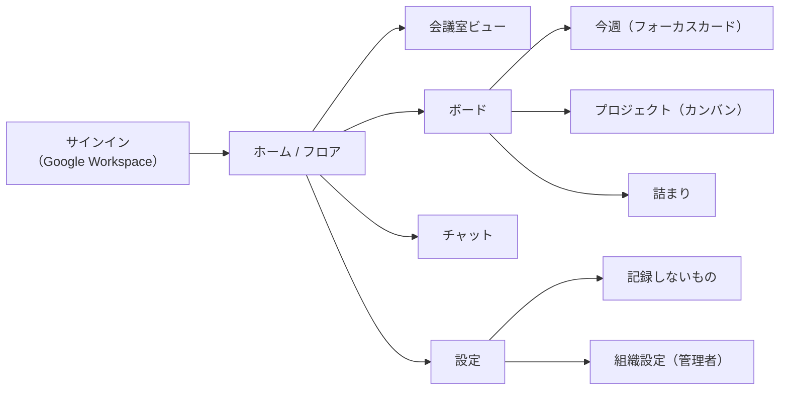
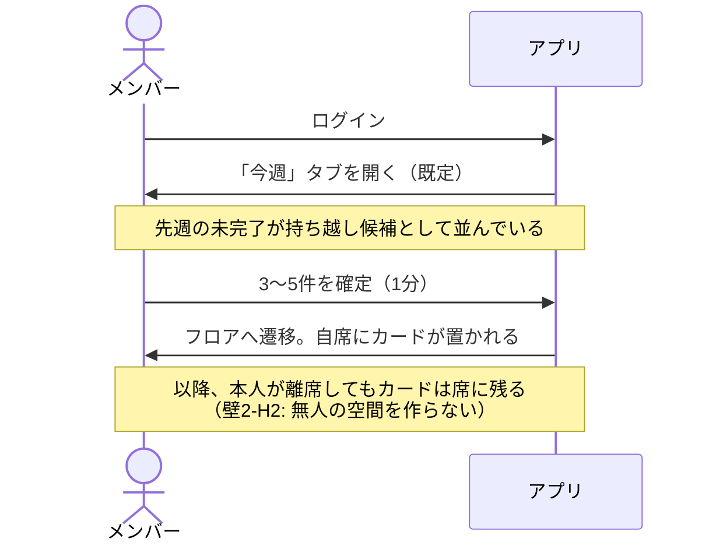
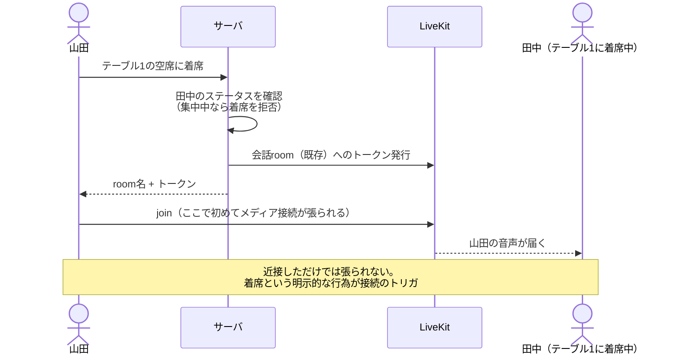

# 03. 機能要件と画面構成

[02. 問題解決](./02-problem-solving.md) の結論に従い、**フォーカスカードを中核**として機能を組む。
空間・会議室は「フォーカスカードを面白くする装置」という位置づけである。

---

## 1. 機能一覧

優先度は MoSCoW（Must / Should / Could / Won't）。**Won't は意図的な非機能**であり、後から足す候補ではない。

### 1.1 Must（v1 に必須）

| ID | 機能 | 概要 |
| --- | --- | --- |
| M-01 | 組織認証 | Google Workspace / Microsoft 365 の OIDC。`hd` クレームでメールドメインを検証し、同一ドメインのみ入室可 |
| M-02 | メンバー管理 | 招待、ロール（`MEMBER` / `ADMIN`）、退会 |
| M-03 | フロア表示 | **3D空間（low-poly・固定クォータービュー）** に自分と他人のアバターを描画（[02 §6](./02-problem-solving.md)） |
| M-04 | アバター移動 | キーボード（WASD / 矢印）とクリック移動。他人の位置は補間表示 |
| M-05 | ステータス | `オープン` / `集中中` / `会議中` / `離席` の自己申告。**推定しない** |
| M-06 | 着席通話 | テーブルの席に座ると、同じテーブルの人と音声が繋がる |
| M-07 | ノック | 相手に近づいて「ノック」→ 相手が承認したら通話開始。拒否・無視が自然にできるUI |
| M-08 | 会議室 | エリアに入ると通話開始。ビデオ ON 可、画面共有可 |
| M-09 | プライベートルーム | 招待制 or ノック承認制。**非参加者にはメディアが配信されない**。**E2EE 強制**（[07 §4](./07-security.md)） |
| M-09b | 音声の E2EE | 既定 ON。SFU にも復号させない（[07 §4](./07-security.md)） |
| M-10 | フォーカスカード | 今週やること 3〜5件の宣言。作成・並べ替え・完了・持ち越し |
| M-11 | カード吹き出し | アバターに近づくとその人のカードが見える |
| M-12 | 詰まり表示 | 3日以上動いていない項目を**プロジェクト単位・匿名**で表示 |
| M-13 | チャンネルチャット | 組織/プロジェクト単位のテキストチャンネル |
| M-14 | DM | 1対1のテキスト |
| M-15 | 記録しないもの | 「本プロダクトが保存しないデータ」の常設ページ |
| M-16 | 解像度スケーリング | フレームタイムに応じて内部解像度を 1.0x / 0.75x / 0.5x に自動調整（[02 §6.4](./02-problem-solving.md)） |
| M-17 | **2D ビュー** | **同じ論理データを見下ろしスプライトで描画**。WebGL 不可・VDI 向け（[02 §6.5](./02-problem-solving.md)） |
| M-18 | リストモード | 空間描画を捨て、メンバー一覧＋カード＋チャットのみ。極端に非力な環境向け |
| M-19 | 接続診断ツール | 導入前に UDP / TURN / WebSocket / 帯域 / 遅延を判定し、情シス向けレポートを出力（[02 壁5](./02-problem-solving.md)） |
| M-20 | 低帯域モード | 音声を 16kbps、位置同期を 3Hz に落とす |
| M-21 | テキストモード | 通話機能を使わず、空間・カード・チャットのみ。通話は既存の Zoom/Teams に任せる |

### 1.2 Should（v1 に入れたい）

| ID | 機能 | 概要 |
| --- | --- | --- |
| S-01 | プロジェクトボード | カンバン。**フォーカスカードより後に作る**（[02 壁1](./02-problem-solving.md) 参照） |
| S-02 | 会議室予約 | 時間指定の予約。フロア上に次の予約が見える |
| S-03 | チケットURL展開 | Jira / Linear / GitHub の URL を貼るとタイトルと状態を**読み取りのみ**表示 |
| S-04 | 朝のリマインド | 1日1回だけ。時刻は組織で設定 |
| S-05 | 会話後のタスク化提案 | 通話終了時に1度だけ提案。拒否したら以後出さない |
| S-06 | 絵文字リアクション | アバターの上に一時表示（3秒で消える） |
| S-07 | エクスポート | フォーカスカード / タスクの Markdown・CSV 出力 |
| S-08 | セルフホスト一式 | docker compose での自社設置（[02 壁4・壁5](./02-problem-solving.md)） |
| S-09 | SCIM | 退職者の即時遮断。情シス要件 |

### 1.3 Could（v2 以降）

| ID | 機能 |
| --- | --- |
| C-01 | ホワイトボード（会議室内） |
| C-02 | 複数フロア（部署別など）と階層移動 |
| C-03 | ゲスト招待（時間制限つきリンク） |
| C-04 | Webhook 送出（詰まり検知を Slack へ） |
| C-05 | モバイル閲覧（カードとチャットのみ） |

### 1.4 Won't（作らない）

| 項目 | 理由 |
| --- | --- |
| 近接したら自動で通話が始まる | [00. 原則1](./00-overview.md)。ノック/着席の opt-in にする |
| キーボード操作・アクティブウィンドウからのステータス自動判定 | [00. 原則2](./00-overview.md) |
| 個人別の在席時間・オンライン時間・稼働率ダッシュボード | [00. 原則3](./00-overview.md)、[02 壁3](./02-problem-solving.md) |
| 会話履歴（誰と誰が何分話したか）の永続化 | 同上。Redis の一時レコードのみ |
| タスクの期限切れ強調（赤字・バッジ・件数通知） | [00. 原則4](./00-overview.md) |
| 個人別のベロシティ・消化率グラフ | 同上 |
| 通話の録画・自動文字起こし | 原則3と衝突。やるなら全員の明示同意UIの設計が先 |
| Jira / Asana との双方向同期 | [02 壁1](./02-problem-solving.md)。維持コストが統合の価値を上回る |
| アバターの課金カスタマイズ・装飾アイテム | 目新しさの追加は定着率を解かない（[02 壁2-H1](./02-problem-solving.md)）。3D ではアセット量とドローコールにも直結する |
| 誰でも編集できるフロアエディタ | 運用が荒れる。v1 は管理者が JSON を入れる |
| ネイティブアプリ | ブラウザで足りる。**インストール不要であることがセキュリティ審査を通す最大の武器**（[02 壁4](./02-problem-solving.md)） |
| **自由回転する3Dカメラ** | 固定クォータービューにする。3D酔いを防ぎ、VDIの帯域とカリングにも効く（[02 §6.7](./02-problem-solving.md)） |
| **動的シャドウ・ポストエフェクト・動的ライティング** | 内蔵GPU で 30fps を割る主因。ライティングは事前ベイク（[02 §6.3](./02-problem-solving.md)） |
| **3D を必須にすること** | 3D は採用するが、2D ビューとリストモードへの縮退を必ず残す（[02 §6.5](./02-problem-solving.md)） |
| 外部アバターサービス（VRM / Ready Player Me 等）への依存 | セルフホストを壊し、壁4 に跳ね返る |
| 常時マイク接続（ミュートで待機） | 通話時のみ `getUserMedia` を呼ぶ。**マイクを掴んでいないことを OS が証明する状態**を維持する（[02 壁4](./02-problem-solving.md)） |
| 独自ポートでの通信 | 443 のみ。情シスの許可リストを5行以内に収める（[02 壁5](./02-problem-solving.md)） |

---

## 2. 画面構成



### 2.1 フロア（メイン画面）

アプリを開いたときの既定画面。

```
┌────────────────────────────────────────────────────────────┐
│  Hidamari    [フロア] ボード  チャット           👤 山田 ▾  │
├──────────────────────────────────────┬─────────────────────┤
│                                      │  今週のわたし        │
│      ┌──────────┐                    │  ◻ 決済APIの設計    │
│      │ 会議室A  │      🧑 佐藤       │  ◻ オンボード資料   │
│      │ 〜11:00  │      ┌──────┐      │  ⚠ 請求バッチ調査   │
│      └──────────┘      │ 今週  │     │     3日動いてない   │
│                        │ ◻ 決済│     ├─────────────────────┤
│   🧑‍🦰 山田(自分)         └──────┘     │  いま居る人 (6)      │
│                                      │  🟢 佐藤   オープン  │
│      ▢▢▢ テーブル1  🧑 鈴木 🧑 田中  │  🔵 鈴木   会議中    │
│                                      │  ⚪ 田中   集中中    │
│      ┌──────────┐                    │  ...                 │
│      │ 集中ルーム│                    │                     │
│      └──────────┘                    │                     │
├──────────────────────────────────────┴─────────────────────┤
│  🎤 OFF   📷 OFF   🖥 共有    ステータス: オープン ▾        │
└────────────────────────────────────────────────────────────┘
```

- **中央**: タイルマップ。自分のアバターを動かす
- **他人に近づくと**: その人のフォーカスカードが吹き出しで出る（M-11）
- **話しかける**: 同じテーブルの席をクリックして着席（M-06）、または相手を選んでノック（M-07）
- **右パネル**: 自分の今週のカード + 在室メンバー。タブで切り替え
- **下部バー**: マイク/カメラ/画面共有/ステータス。**通話していない間はマイクもカメラも接続自体が無い**

**注意すべき設計点**: 近づいただけでは音は繋がらない。
アバターの周囲に「話しかけられます」のリングが出るだけ。これが [00. 原則1](./00-overview.md) の UI 上の実装。

### 2.2 会議室ビュー

会議室エリアに入ると、フロアの上にオーバーレイでビデオグリッドが開く。

- 参加者のビデオタイル、画面共有時は共有を主表示
- **参加者のフォーカスカードが左に並ぶ**（M-11 の会議室版。議題を思い出す装置）
- プライベートルームの場合、フロア側からは「使用中」としか見えない（人数も非公開に設定可能）
- 退出時に「この会話から項目を足しますか?」を1度だけ提案（S-05）

### 2.3 ボード

3つのタブを持つ。**既定は「今週」**。

| タブ | 内容 |
| --- | --- |
| **今週** | 自分のフォーカスカード。3〜5件。ドラッグで並べ替え、チェックで完了、翌週へ持ち越し |
| **プロジェクト** | カンバン（`BACKLOG` / `THIS_WEEK` / `IN_PROGRESS` / `BLOCKED` / `DONE`）。Should 扱い |
| **詰まり** | 3日以上動いていない項目を**プロジェクト単位・担当者名なし**で表示（M-12） |

「今週」を既定にすることで、[02 壁2-H1](./02-problem-solving.md) の「朝1分の習慣」が動線として成立する。

### 2.4 設定

- 個人: 表示名、アバタープリセット、既定ステータス、リマインド時刻
- **記録しないもの**（M-15）: 保存していないデータの一覧。管理者にも見えないことを明記
- 組織（管理者のみ）: メンバー、フロアのマップ定義、チェックイン時刻、Webhook

---

## 3. 主要フロー

### 3.1 朝の1分（このプロダクトの中心動線）



### 3.2 話しかける（着席）



### 3.3 話しかける（ノック）

1. 相手のアバターを選んで「ノック」（任意で一言添えられる）
2. 相手に控えめな通知（音は鳴らさない）。選択肢は **「今いいよ」/「あとで」/（無反応）**
3. 「今いいよ」でのみ会話 room が作られる
4. **無反応は正常な応答として扱う**。既読も、無視した回数も、どこにも残さない

「あとで」を押すと、相手の手が空いたときに本人の意思で折り返せるよう、ノックした事実だけが相手側に残る（山田側には見えない）。

### 3.4 集中する

1. ステータスを `集中中` にする
2. 着席・ノックの対象外になる（近づいてもリングが出ない）
3. DM・メンションは**溜まるだけで通知が飛ばない**
4. 解除すると、溜まっていたものが一覧で出る

---

## 4. 権限モデル

| 操作 | MEMBER | ADMIN |
| --- | --- | --- |
| フロア入室、移動、会話 | ✅ | ✅ |
| 自分のフォーカスカード編集 | ✅ | ✅ |
| 他人のフォーカスカード閲覧 | ✅（同一組織内） | ✅ |
| 他人のフォーカスカード編集 | ❌ | ❌ |
| 詰まり（プロジェクト単位・匿名） | ✅ | ✅ |
| メンバー招待・削除 | ❌ | ✅ |
| フロアのマップ定義変更 | ❌ | ✅ |
| **個人の在席・稼働の閲覧** | ❌ | ❌（APIが存在しない） |
| **会話履歴の閲覧** | ❌ | ❌（保存されていない） |
| プライベートルームの中身 | ❌（非参加者） | ❌（非参加者） |

**最下段3行が重要**。管理者ロールにも与えない。
「権限で禁止している」のではなく「データもAPIも無い」状態にする（[05. データモデル](./05-data-model.md)）。

---

## 5. 非機能要件

想定する最低スペックと最悪のネットワークを先に固定する。ここを外すと以降の設計が机上の空論になる。

```
端末: Core i5-8250U 相当 / 内蔵GPU / メモリ8GB / Windows 11 / Chrome
      かつ Excel・Teams・タブ15個が同時に開いている状態（VDI の場合も含む）
回線: UDP がファイアウォールで全面ブロックされている環境でも動作すること
```

| 分類 | 要件 |
| --- | --- |
| **軽さ** | 非アクティブタブで実質CPU 0。アクティブ非通話時 **10%未満**。タブのメモリ **350MB 以内**。アイドル上り 10kbps 未満（[02 壁2-H3・壁6](./02-problem-solving.md)） |
| **描画** | **30fps 上限**（60fps は目指さない）。**ドローコール 100未満 / 三角形 150k未満 / テクスチャ 64MB未満**。影・動的ライト・ポストエフェクトなし。静止時は再描画しない（VDI の帯域対策）。WebGL 不可の環境では **2D ビュー**にフォールバック |
| **アセット** | 初回ダウンロード 5MB 以内（glTF + Draco）。アバターはプリセット固定 |
| **回線** | UDP 全面ブロック環境でも TURN over TCP/443 で通話が成立すること。使用ポートは 443 のみ |
| **帯域** | アイドル 10kbps / 音声通話 40kbps / 低帯域モード 20kbps / テキストモード 5kbps |
| 応答性 | 自分の移動は即時（楽観的更新）。他人の位置は 200ms 以内に反映 |
| 音声品質 | 会話開始（着席/ノック承認）から音が出るまで 1.5秒以内 |
| 同時接続 | 1組織 80人が同一フロアにいても破綻しない |
| 可用性 | 会話中の切断からの自動復帰。ゴーストアバターを 30秒以内に消す |
| ブラウザ | Chrome / Edge / Safari の最新2バージョン。Firefox は best effort |
| プライバシー | DTLS-SRTP に加え、**音声は E2EE を既定 ON**（SFU も復号できない）。プライベートルームは E2EE 強制。**非参加者へは配信経路自体が存在しない**（[07. 接続の安全性](./07-security.md)） |
| アクセシビリティ | キーボードのみで移動・着席・会話開始が可能。カードはスクリーンリーダー対応。**3D が扱いにくい利用者には 2D ビュー／リストモードが代替経路になる** |
| 国際化 | v1 は日本語。文言は i18n 経由で持ち、英語を後から足せる形にする |
| **審査対応** | 通信先ドメイン一覧・データフロー図・保存データ一覧・監査ログ仕様書を成果物として持つ（[02 壁4](./02-problem-solving.md)） |
| **設置形態** | SaaS とセルフホスト（自社VPC / オンプレ）の両方で動くこと。構成要素はすべて OSS |
| **トークン** | room 限定・5分の短命 JWT。localStorage に置かない。発行経路は1モジュールに集約（[07 §7](./07-security.md)） |
