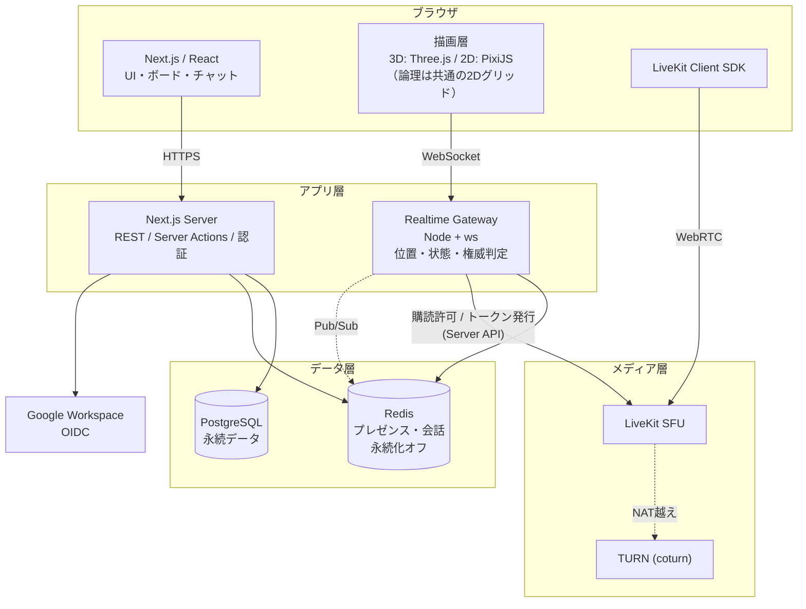
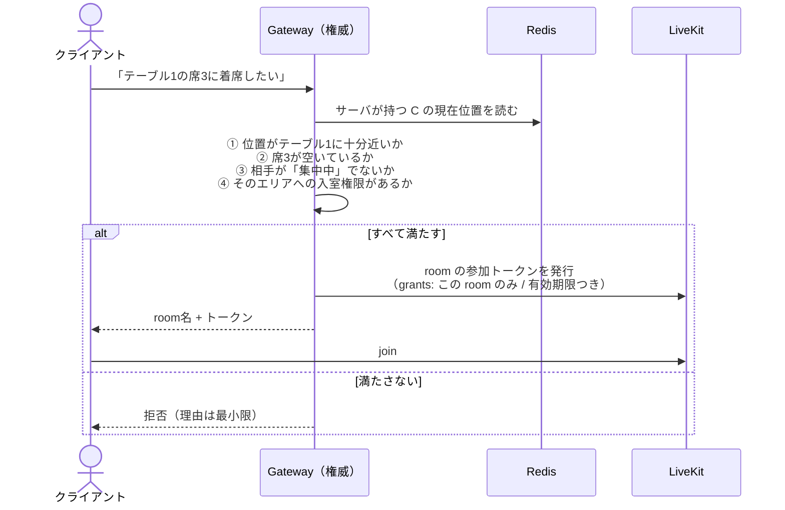
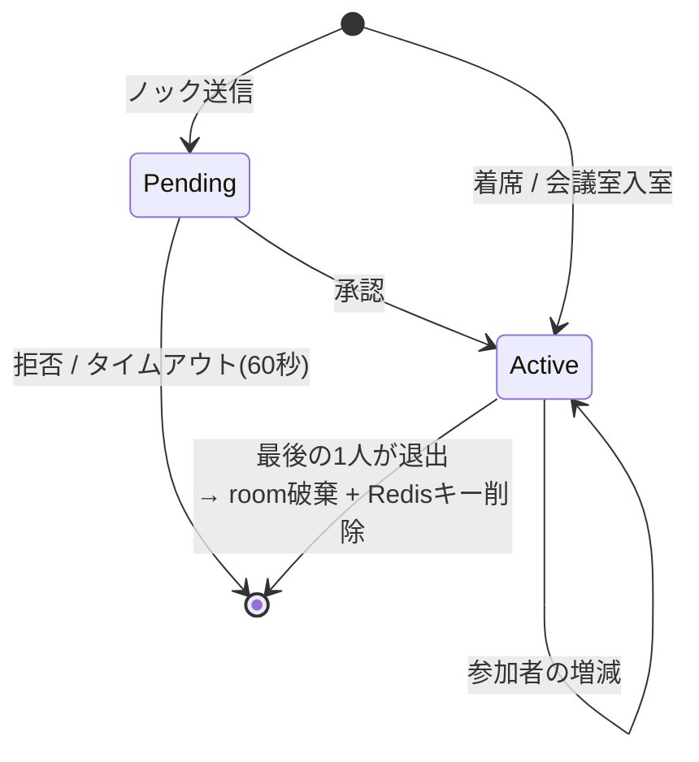
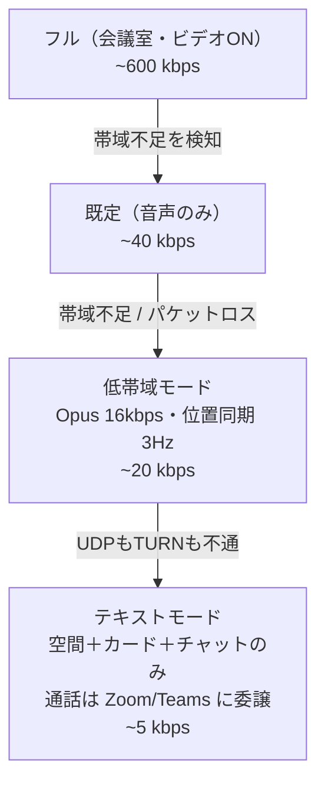
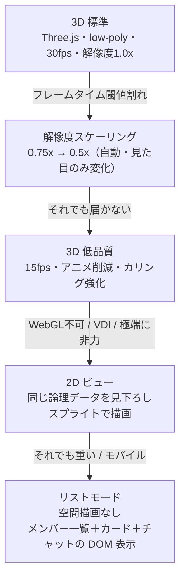

# 04. アーキテクチャ

[02. 問題解決](./02-problem-solving.md) で挙げた技術課題 T1〜T7 に答えを与える。
設計判断はすべて [00. Chill 設計原則](./00-overview.md) から導いてある。
**原則が技術を単純にしている箇所が複数ある**ので、そこは明記した。

---

## 1. 全体構成



**分離の理由**: Next.js は HTTP のリクエスト/レスポンス向きで、
数十人 × 10Hz の常時接続を捌く形になっていない。
位置同期と権威判定は独立した長寿命プロセス（Gateway）に置く。

---

## 2. 技術選定

| 層 | 採用 | 理由 | 却下した候補 |
| --- | --- | --- | --- |
| フロント | Next.js 15 (App Router) + TypeScript | 認証・REST・SSR を1つで賄える。エコシステムが厚い | SPA + 別API（構成が増える） |
| 空間描画（3D・標準） | **Three.js**（＋ React Three Fiber） | エコシステムが最も厚い。low-poly + ベイク済みライティングなら内蔵GPU でも 30fps が現実的（[02 §6.3](./02-problem-solving.md)） | Babylon.js（有力だが情報量で劣る）、Unity WebGL（初回ロードが重すぎる） |
| 空間描画（2D・縮退先） | **PixiJS**（WebGL / Canvas2D フォールバック） | WebGL 不可・VDI 環境の受け皿。**同じ論理データを描画する**（§4.5） | — |
| アセット形式 | **glTF + Draco 圧縮** | Web 標準。初回DL 5MB 以内を狙える | FBX（Web 向けでない）、VRM（外部エコシステム依存で壁4 に不利） |
| マップ形式 | **論理: 独自グリッドJSON / 2D表現: Tiled (.tmj) / 3D表現: glTF + 配置JSON** | 論理と表現を分離する（§4.5）。2D 表現は Tiled 資産と WorkAdventure の知見を流用できる | 3Dシーンを唯一の正にする（縮退できない一本道になる） |
| リアルタイム | **自前 Node + `ws`** + Redis Pub/Sub | 権威判定をサーバに置く必要がある（§5 T4）。プロトコルを自分で最適化できる | Socket.IO（オーバーヘッド）、Liveblocks/PartyKit（権威判定を握れない） |
| メディア | **LiveKit**（Cloud → 後にセルフホスト可） | 選択的購読 API が近接モデルに直接対応。OSS でロックインが浅い。WorkAdventure も採用 | mediasoup（低レベルすぎ、運用負荷）、素のP2P（§5 T1 で破綻） |
| DB | PostgreSQL + Prisma | 素直。型がフロントと共有できる | MongoDB（関係が多いデータに不利） |
| 揮発データ | **Redis（永続化 AOF/RDB を無効）** | プレゼンスと会話を「消える」形で持つのが [00. 原則3](./00-overview.md) の技術的担保 | Postgres に持つ（消し忘れがログになる） |
| 認証 | Auth.js v5 + Google/Microsoft OIDC | `hd` / `tid` クレームでドメイン検証できる | 自前パスワード認証（会社単位に不要かつ危険） |
| ホスティング | フロント: Cloud Run / Vercel<br/>Gateway: **Fly.io / Cloud Run(WS対応)** | Gateway は常時接続なのでサーバレス関数に置けない | Vercel Functions に Gateway を置く（不可） |

---

## 3. 3つのチャネル分離

すべてを1本の接続に載せると、要求特性が違うものが混ざって破綻する。3本に分ける。

| ch | 内容 | 転送 | 頻度 | 保証 | 永続 |
| --- | --- | --- | --- | --- | --- |
| **A. 位置** | x, y, 向き | WebSocket（binary） | 送信10Hz / 描画は補間で60fps | **保証なし**（落ちても次のtickで直る） | しない |
| **B. 状態** | ステータス変更、入退室、着席、ノック、会話の開始終了 | WebSocket（JSON） | イベント駆動 | 順序保証・再送・ACK | Redis（TTL付き） |
| **C. 永続** | タスク、フォーカスカード、チャット履歴、組織・メンバー | HTTPS（REST / Server Actions） | 操作時のみ | トランザクション | PostgreSQL |

A と B は同一の WebSocket 接続に多重化する（フレーム先頭1バイトで種別を判別）。接続を2本張らない。

---

## 4. 位置同期 — T2 / T6 の解

### 4.1 素朴な実装が破綻する理由

50人が各自 10Hz で位置を送り、サーバが全員に転送すると:

```
50 (送信者) × 10 (Hz) × 50 (受信者) = 25,000 メッセージ/秒
```

メッセージ**数**が問題になる（バイト数ではない）。WebSocket のフレーム処理とイベントループが先に飽和する。

### 4.2 解: tick ベースのブロードキャスト + AOI フィルタ

**(1) tick 集約** — サーバは受信した位置を溜めておき、100ms ごとに **1メッセージにまとめて**送る。

```
50 (受信者) × 10 (Hz) = 500 メッセージ/秒
```

メッセージ数が 1/50 になる。1メッセージには複数人分の座標が入るが、
1人あたり 9バイト（id:2 + x:2 + y:2 + dir:1 + status:1 + flags:1）なので、
50人分でも 450バイト程度。帯域はまったく問題にならない。

**(2) AOI（Area of Interest）フィルタ** — さらに、各受信者に **画面に映る範囲＋余白** の人の座標だけ送る。

- 空間をグリッド（例: 16×16タイル）に分割し、Redis に `space:{id}:cell:{cx}:{cy}` として在室者を持つ
- 自分のセルと隣接8セルにいる人だけを対象にする
- 80人の組織でも、1人が同時に見るのは通常 10〜25人程度に収まる

結果、**アイドル時の上り 10kbps 未満**（[03. 非機能要件](./03-features.md)）が達成できる。

### 4.3 描画側

- 受信は 10Hz。描画は 60fps。間は**補間**（線形 + 到着遅延1tick分のバッファ）で滑らかにする
- 自分のアバターは**楽観的更新**（サーバ応答を待たない）。サーバが矛盾を検知した時のみ補正
- `document.visibilityState === 'hidden'` で **描画ループを完全停止し、送信を 0.2Hz に落とす**
  → [02 壁2-H3](./02-problem-solving.md) の「非アクティブタブでCPU実質0」の実装

### 4.4 ゴーストアバター — T6 の解

切断されたアバターがフロアに残る問題。

- プレゼンスは Redis に **TTL 30秒** で持ち、クライアントは 10秒ごとに heartbeat で延長
- WebSocket の `close` を受けたら即座に削除して退室を broadcast（正常系）
- 異常切断（プロセス落ち・ネットワーク断）は TTL 失効で消える（異常系）
- Gateway 側で 5秒ごとに失効チェックを走らせ、消えた分を broadcast する

**TTL 方式を選んだのは原則3のためでもある**。プレゼンスは「延長されなければ自然に消える」データであり、
明示的に削除しなくても記録が残らない。

---

### 4.5 論理レイヤーと表現レイヤーの分離（3D 採用の前提条件）

**3D は「表現」であり、論理には一切影響させない。** これが [02 §6.1](./02-problem-solving.md) の実装方針である。

| レイヤー | 持つもの | 誰が権威か |
| --- | --- | --- |
| **論理** | 2Dグリッド座標 (x, y, dir)、当たり判定、エリア境界、席の位置 | **サーバ** |
| **表現** | 3Dモデルの配置、カメラ、マテリアル、アニメーション、スプライト | クライアントのみ |

帰結:

- **位置同期（§4.1〜4.3）は 3D 化の影響を受けない。** 送るのは今まで通り 9バイト/人。帯域も tick も AOI も変わらない
- サーバは 3D を一切知らない。当たり判定もエリア判定もグリッド上の整数演算のまま
- **同じ論理データを、3D / 2D / リストのどの表現でも描ける**（§10.5）
- 3D アセットの差し替えがサーバに影響しない

インターフェースはこの形にする。

```ts
interface SpaceRenderer {
  mount(container: HTMLElement, space: SpaceLogic): void
  applyTick(positions: PositionFrame): void   // 論理座標を受け取るだけ
  setQuality(q: QualityLevel): void
  unmount(): void
}
// 実装: ThreeRenderer / PixiRenderer / (リストモードは Renderer を持たない)
```

**この分離が実装できないなら 3D は採用すべきではない**（[02 §6.1](./02-problem-solving.md)）。
縮退経路を失い、壁6 が閉じられなくなるためである。

### 4.6 3D 描画の予算（内蔵GPU で 30fps を守るための制約）

| 項目 | 上限 | 手段 |
| --- | --- | --- |
| ドローコール | **100 未満** | 家具・壁はインスタンシング。マテリアル種類を絞る |
| 三角形数 | **150k 未満** | low-poly。遠景は LOD / カリング |
| テクスチャ総量 | **64MB 未満** | アトラス統合、解像度上限 1024px |
| 初回ダウンロード | **5MB 以内** | glTF + Draco、アバターはプリセット固定 |
| 動的シャドウ | **0** | ブロブシャドウ（円形の板ポリ）で接地感を出す |
| 動的ライト | **0** | ライトマップに事前ベイク |
| ポストエフェクト | **0** | Bloom / SSAO / DOF を使わない |
| 内部解像度 | 1.0x / 0.75x / **0.5x** | フレームタイムに応じて自動調整（§10.5） |

カメラは **固定クォータービュー**（回転・自由ズームなし）。
カリングが効き、3D 酔いが起きず、VDI で画面全体が変化しにくくなる（[02 §6.7](./02-problem-solving.md)）。

---

## 5. 音声・映像 — T1 / T4 の解

### 5.1 T1: N² 問題

素の P2P メッシュだと、同一エリアの N 人で N(N-1)/2 本の接続が張られる。
10人で45本。上りが 9倍になり、ノートPCで即座に破綻する。

→ **SFU（LiveKit）を使う。** 各クライアントの上りは常に1本。

### 5.2 room の切り方 — 設計原則が技術を単純にした箇所

| 案 | 内容 | 評価 |
| --- | --- | --- |
| 案1: room = フロア全体 | 全員が1つの room に入り、購読を細かく制御する | ❌ 80人の巨大 room。購読制御を1箇所でも間違えると音が漏れる。プライベートルームの秘匿を「制御の正しさ」に依存させることになる |
| **案2: room = 会話（Conversation）単位** | 会話が始まるときに room を作り、参加者にだけトークンを発行 | ✅ **採用** |

案2 の欠点は「room への join にかかる数百msのレイテンシ」である。
Gather 型の「近づいた瞬間に音が聞こえる」を実装するなら致命的だが、
**本プロダクトは [00. 原則1](./00-overview.md) により、そもそも近接で自動接続しない。**
着席やノック承認という明示的な行為がトリガなので、そこに数百ms かかっても違和感がない。

> **設計原則が技術的困難を消している。**
> 「Chill だから接続を遅くしていい」ではなく、「Chill にしたら難しい部分が要らなくなった」。
> 迷ったときはこの関係を思い出すこと。

さらに副次的な効果として:

- 通話していない間は **LiveKit に接続すらしない** → [03. 非機能要件](./03-features.md) の「軽さ」が自然に達成される
- 同じ理由で **通話していない間は `getUserMedia()` を呼ばない**。
  ブラウザと OS のマイク使用インジケータが通話中だけ点灯する。
  「盗聴していない」ことを OS が第三者として証明してくれる状態になり、
  セキュリティ審査で最も強い回答になる（[02 壁4](./02-problem-solving.md)）
- 通話していない間は帯域も CPU も使わない（[02 壁5・壁6](./02-problem-solving.md)）
- LiveKit の課金は接続時間ベースなので、**コストも下がる**（§9）

### 5.3 T4: 座標を偽装した盗聴

クライアントが「私は今テーブル1にいます」と嘘をつけば、遠くの会話を聞けてしまう。
**クライアントの申告を信じない。**



**位置の権威は常にサーバにある。** クライアントが送るのは「移動したい」という意思であり、
サーバが速度上限と壁の衝突を検証して確定させる。確定した座標だけがブロードキャストされ、
入室判定にもそれが使われる。

トークンは **その room 限定・短命（例: 5分、会話中は更新）** で発行する。
漏れても他の room には使えない。

---

## 6. プライベートルーム — T3 の解

[00. 原則5](./00-overview.md):「UI で隠すのではなく、配信経路自体を作らない」。

- プライベートルームは **独立した LiveKit room**（§5.2 案2 の帰結）
- 非参加者にはトークンが発行されない → SFU が非参加者にストリームを送る経路が**存在しない**
- 入室の判定は Gateway が行う:
  - `INVITE_ONLY`: 招待済みユーザーIDのリストに含まれるか
  - `KNOCK`: 室内の誰かが承認したか
  - `OPEN`: エリアに入れば誰でも
- **在室者の可視性も設定可能**: `誰がいるか見える` / `使用中とだけ見える` / `何も見えない`

フロア上の描画も、サーバが送るデータの時点で落とす。
「クライアントには届いているが CSS で隠している」という実装は禁止する。

---

## 7. 会話（Conversation）のライフサイクル



**Conversation は PostgreSQL に保存しない。** Redis の一時レコードのみ（TTL 付き）。
保存すると「誰と誰が何分話したか」の完全なログになり、[00. 原則3](./00-overview.md) が崩れる。

永続化するのは会議室の**予約**（`MeetingBooking`）だけで、これは未来の予定であって過去の記録ではない。
詳細は [05. データモデル](./05-data-model.md)。

---

## 8. ブラウザ差異 — T5 の解

| 問題 | 対策 |
| --- | --- |
| **Safari の autoplay policy**: ユーザー操作なしに音声を再生できない | 会話開始が必ずクリック（着席・承認）を伴う設計なので、**そのクリックのハンドラ内で `AudioContext.resume()` を呼ぶ**。原則1がここでも効いている |
| Safari のデバイス列挙が権限取得前は空 | 初回のみ「マイクを準備」ステップを挟み、以後は許可済みデバイスを記憶 |
| iOS Safari のバックグラウンドで WebSocket が切れる | 復帰時の再接続とプレゼンス再登録を実装。ゴースト対策（§4.4）が同時に効く |
| Firefox の `getDisplayMedia` の挙動差 | 画面共有は best effort。非対応時は機能を隠す（エラーを出さない） |
| 企業ネットワークで UDP が塞がれている | **TURN (coturn) を TCP/443 で必ず用意する**。ここを省くと一部の顧客環境で完全に動かない |

---

## 9. スケールとコスト構造 — T7 の解

### 9.1 想定負荷（1組織 80人・同一フロア）

| 項目 | 見積もり |
| --- | --- |
| WebSocket 同時接続 | 80 |
| 位置ブロードキャスト | 80 × 10Hz = 800 msg/s（AOI で1メッセージあたり ~20人分） |
| 上り帯域（Gateway） | 800 × ~200B ≒ 160 KB/s ≒ 1.3 Mbps |
| Gateway インスタンス | **1台で十分**。2台目は冗長化目的 |
| 同時通話 | 平均20%が通話中と仮定 → 16人 ≒ 5〜8会話 |

位置同期は驚くほど軽い。**支配的なのはメディアである。**

### 9.2 コストの支配要因

```
総コスト ≒ LiveKit(接続時間 × 帯域) + Gateway(常時起動) + DB/Redis + Next.js
             ▲ 支配的
```

- 音声のみ 1人あたり ~40kbps、ビデオ ON で ~600kbps〜。**ビデオが1桁効く**
- 会議室以外ではビデオを既定 OFF にする設計が、そのままコスト対策になっている
- §5.2 の「通話中だけ接続する」により、80人が1日8時間ログインしていても
  課金対象は「実際に通話していた時間」だけになる

> 単価は変動するため、金額は Phase 0 のスパイクで実測して確定させる（[06. ロードマップ](./06-roadmap.md)）。
> ここで固定しておくのは **コスト構造**（何が効くか）であって金額ではない。

### 9.3 マルチテナントとスケールアウト

- 1つの Gateway プロセスが複数組織を持つ。組織IDで名前空間を分ける
- 複数インスタンスにする場合は **組織単位で1インスタンスに固定**（sticky）する。
  組織をまたいだブロードキャストは存在しないので、Redis Pub/Sub は
  「同一組織が別インスタンスに分散した場合」のフォールバックとしてのみ使う
- 数千人規模になると空間分割（フロア単位のシャーディング）が必要だが、**それは非ターゲット**（[00](./00-overview.md)）

---

## 10. デプロイ形態と縮退 — 導入障壁への対応

[02 Part 2](./02-problem-solving.md) の壁4〜6 に対する構成上の答え。

### 10.1 2つのデプロイ形態

構成要素をすべて OSS で選定した（§2）のは、この選択肢を残すためである。

| 形態 | 構成 | 解決する壁 |
| --- | --- | --- |
| **SaaS** | 提供側が Next.js / Gateway / LiveKit / DB を運用 | 導入が速い。小規模組織向け |
| **セルフホスト** | 顧客の VPC / オンプレに docker compose 一式を設置 | **壁4**（データが社外に出ない、サブプロセッサ不在）<br/>**壁5**（トラフィックが社内で完結する） |

セルフホストは「オプション」ではなく **審査を通すための主要な手段**として位置づける。
そのため、外部 SaaS への依存（解析、CDN、フォント配信、エラー収集）を安易に増やさない。
**依存を1つ増やすたびに、セルフホストの価値と情シスの許可リストが1行ずつ悪化する。**

### 10.2 通信要件（情シスに提出する形）

| 用途 | プロトコル / ポート | 備考 |
| --- | --- | --- |
| Web / API | HTTPS 443 | |
| リアルタイム（位置・状態） | **wss 443** | 独自ポートを使わない |
| メディア（推奨経路） | UDP 50000-60000 | 通れば低遅延 |
| メディア（代替経路） | **TCP 443 / TURNS** | **UDP 不可の環境向け。必須構成** |

目標は **許可リストに追加する行数を5行以内に収めること**（[02 壁5](./02-problem-solving.md)）。

### 10.3 接続診断ツール

導入前に、その環境で動作するかを判定する公開ページを Phase 1 の成果物に含める。

- 判定項目: HTTPS 到達 / wss 到達と安定性 / UDP 到達性 / TURN over TCP 疎通 / 往復遅延 / 推定帯域
- 結果を **情シス向け PDF レポート**として出力できる（§10.2 の表を含む）
- 実装コストは小さく、導入時の摩擦を大きく減らす

### 10.4 縮退の設計（ネットワーク）



最下段が要点である。**通話がまったく成立しない環境でも、フォーカスカードとチャットは使える。**
[02 壁1](./02-problem-solving.md) でフォーカスカードを中核に据えた設計の副産物として、
通話機能を丸ごと捨ててもプロダクトが成立する。

### 10.5 縮退の設計（端末性能）



**A2（解像度スケーリング）だけは自動で行う。** 見た目の解像感が変わるだけで機能は変わらないためである。
**B より下（表現の切り替え）は 1 度だけ提案し、自動では切り替えない**（[02 §6.8](./02-problem-solving.md)）。

この縮退が成立するのは §4.5 の分離があるからである。
論理データが共通なので、**どの段でも同じ空間・同じ位置・同じ会話が成立する。**

- 起動後30秒のフレームタイムを計測し、閾値を割ったら **1度だけ提案する。自動で切り替えない**
  （[00. 原則2](./00-overview.md)「推定しない」をここにも適用する）
- 選択は端末ごとに記憶する
- **VDI 対策**: 静止しているフレームでは再描画しない。変化した領域のみ更新する。
  VDI では画面全体が動画として転送されるため、常時再描画は端末性能ではなく**回線**を食う（壁6が壁5に転移する）

### 10.6 監査ログの境界（実装上の担保）

[02 壁4 解4](./02-problem-solving.md) の境界線を、実装として固定する。

| テーブル | 記録するもの |
| --- | --- |
| `AuditLog` | ログイン成功/失敗、管理操作、権限変更、エクスポート実行、プライベートルームの作成と招待 |
| （存在しない） | 位置履歴、会話履歴、滞在時間、発話量、既読 |

`AuditLog` に書き込む箇所を1つのモジュールに集約し、
**そこに利用行動を書き込むコードが増えていないかを CI でチェックする**（[06. ロードマップ](./06-roadmap.md)）。

---

## 11. セキュリティ

| 項目 | 方針 |
| --- | --- |
| 認証 | OIDC のみ。`hd`（Google）/ `tid`（Microsoft）で組織ドメインを検証 |
| 認可 | すべての WS メッセージと API で組織IDを検証。**クライアントが送る組織IDを信用しない**（セッションから引く） |
| 位置の権威 | サーバ（§5.3）。速度上限と壁の衝突をサーバで検証 |
| メディア | LiveKit トークンは room 限定・短命。TLS / SRTP |
| プライベート | 配信経路自体を作らない（§6） |
| レート制限 | WS メッセージに per-connection のトークンバケット。位置は 15Hz 超で切断 |
| 入力 | チャット・タスクは保存時にサニタイズ。表示時は React のエスケープに委ねる |
| 監査ログ | **管理操作のみ**記録（メンバー追加削除、権限変更、マップ変更）。**利用行動は記録しない** |

最終行が重要である。監査ログは「管理者が何をしたか」を残すものであり、
「メンバーが何をしていたか」を残すものではない。この区別を実装時に曖昧にしないこと。

---

## 12. 未解決の論点

設計段階で答えを出していない、実装中に決める必要があるもの。

| # | 論点 | 判断の期限 |
| --- | --- | --- |
| O-1 | 位置のバイナリプロトコルの具体的なフォーマット（可変長ID、差分エンコード） | Phase 1 前半 |
| O-2 | LiveKit を Cloud で始めるかセルフホストで始めるか（コスト実測後に決定） | Phase 0 終了時 |
| O-3 | Gateway の水平分割が必要になる閾値（実測で決める） | Phase 5 |
| O-4 | フォーカスカードの週の区切り（月曜始まり固定か、組織設定か） | Phase 2 前 |
| O-5 | 「詰まり」の閾値 3日 が妥当か（ドッグフーディングで検証） | Phase 5 |
| O-6 | チャットを本気で作るか、最小限に留めて Slack 併用を許容するか | Phase 4 前 |
