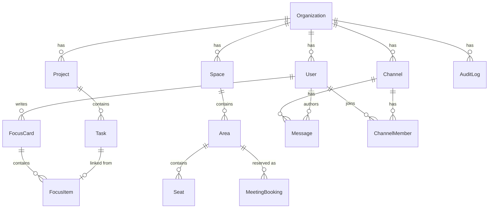

# 05. データモデル

このドキュメントの最大の役割は **「作らないもの」を確定させること** である。
[00. 原則3](./00-overview.md)（在席ログを残さない）と
[02 壁4](./02-problem-solving.md)（監査ログとの境界）は、
運用ルールではなく **スキーマとして担保されて初めて意味を持つ**。

---

## 1. 保存先の3分類

| 分類 | 保存先 | 性質 |
| --- | --- | --- |
| **永続** | PostgreSQL | 組織、メンバー、フォーカスカード、タスク、チャット、会議室予約、監査ログ |
| **揮発** | Redis（**AOF / RDB を無効化**） | プレゼンス、会話、ノック、AOI インデックス。プロセスが落ちれば消える |
| **保存しない** | — | 位置履歴、会話履歴、滞在時間、発話量、既読 |

**Redis の永続化を無効にするのは設計判断である。** 高速化のためではない。
「明示的に消さなくても、いずれ必ず消える」状態を作るためである。

---

## 2. ER 図（永続データ）



---

## 3. スキーマ（Prisma 表記）

### 3.1 組織とメンバー

```prisma
model Organization {
  id           String   @id @default(cuid())
  name         String
  emailDomain  String   @unique   // 例: example.co.jp。OIDC の hd / tid と照合
  idpType      IdpType             // GOOGLE | MICROSOFT
  checkInTime  String   @default("10:00")  // 壁2-H2 のチェックイン時刻
  createdAt    DateTime @default(now())
}

model User {
  id            String   @id @default(cuid())
  orgId         String
  email         String
  displayName   String
  avatarPreset  Int      @default(0)   // プリセットのみ。カスタマイズは作らない
  role          Role     @default(MEMBER)
  deactivatedAt DateTime?              // 退職者の即時遮断（論理削除）
  createdAt     DateTime @default(now())

  @@unique([orgId, email])
}

enum Role { MEMBER ADMIN }
```

> **`lastSeenAt` を置いていない。** 「最終ログイン日時」は一見無害だが、
> 毎日更新すれば実質的に在席ログになる。[00. 原則3](./00-overview.md) に反するため作らない。
> 退職者の遮断には `deactivatedAt`（管理操作の結果）を使う。

### 3.2 空間

**論理レイヤーと表現レイヤーを分離する**（[02 §6.1](./02-problem-solving.md)）。
座標・当たり判定・エリア判定はすべて 2D グリッドで持ち、3D は表現データとして別に置く。
これにより 3D → 2D ビュー → リストモードへの縮退が、論理を一切変えずに成立する。

```prisma
model Space {
  id        String @id @default(cuid())
  orgId     String
  name      String

  // 論理レイヤー（唯一の正）— 当たり判定・エリア・席。表現方式に依存しない
  grid      Json                    // { width, height, blocked: [[x,y],...] }

  // 表現レイヤー（描画のためだけのデータ）
  scene3d   Json?                   // 3D: glTF アセットID と配置（位置・回転・種別）
  tilemap2d Json?                   // 2D ビュー: Tiled (.tmj) 形式
}

model Area {
  id             String       @id @default(cuid())
  spaceId        String
  kind           AreaKind
  name           String
  bounds         Json                     // { x, y, w, h }（タイル座標）
  capacity       Int?
  accessPolicy   AccessPolicy @default(OPEN)
  invitedUserIds String[]     @default([])  // INVITE_ONLY のとき
  visibility     Visibility   @default(FULL)
}

enum AreaKind     { OPEN MEETING FOCUS PRIVATE }
enum AccessPolicy { OPEN KNOCK INVITE_ONLY }
enum Visibility   { FULL        // 誰がいるか見える
                    OCCUPIED    // 「使用中」とだけ見える
                    HIDDEN }    // 何も見えない

model Seat {
  id     String @id @default(cuid())
  areaId String
  x      Int
  y      Int
}
```

### 3.3 フォーカスカード（中核）

```prisma
model FocusCard {
  id        String   @id @default(cuid())
  userId    String
  weekOf    DateTime            // その週の月曜 0:00
  updatedAt DateTime @updatedAt

  @@unique([userId, weekOf])
}

model FocusItem {
  id           String     @id @default(cuid())
  focusCardId  String
  text         String                  // ただのテキストでよい
  taskId       String?                 // 内部タスクへの任意リンク
  externalUrl  String?                 // Jira / Linear / GitHub の URL（読み取りのみ）
  status       FocusStatus @default(OPEN)
  order        Int
  lastMovedAt  DateTime   @default(now())  // 「詰まり」判定に使う
}

enum FocusStatus { OPEN IN_PROGRESS BLOCKED DONE }
```

`lastMovedAt` は **項目のステータスが変わった時刻**であり、ユーザーの活動時刻ではない。
[02 壁3](./02-problem-solving.md) の「詰まり」表示（3日以上動いていない項目）に使う。
集計は **プロジェクト単位**で行い、`userId` を出力に含めない。

### 3.4 タスク（Should。フォーカスカードより後に作る）

```prisma
model Project {
  id       String  @id @default(cuid())
  orgId    String
  key      String                  // 例: PROJ
  name     String
  archived Boolean @default(false)

  @@unique([orgId, key])
}

model Task {
  id          String    @id @default(cuid())
  projectId   String
  title       String
  body        String?
  state       TaskState @default(BACKLOG)
  assigneeId  String?
  dueDate     DateTime?             // 合意された期日。UI で赤くしない
  externalUrl String?
  createdAt   DateTime  @default(now())
  updatedAt   DateTime  @updatedAt
}

enum TaskState { BACKLOG THIS_WEEK IN_PROGRESS BLOCKED DONE }
```

> `completedAt` を持たない。持つと個人別の消化数・ベロシティが算出可能になり、
> [00. 原則4](./00-overview.md) に反する。完了は `state = DONE` と `updatedAt` のみで表す。

### 3.5 チャット・会議室予約

```prisma
model Channel {
  id        String      @id @default(cuid())
  orgId     String
  kind      ChannelKind                 // PUBLIC | PRIVATE | DM
  name      String?                     // DM は null
  projectId String?
}
enum ChannelKind { PUBLIC PRIVATE DM }

model ChannelMember {
  channelId String
  userId    String
  @@id([channelId, userId])
}

model Message {
  id        String   @id @default(cuid())
  channelId String
  authorId  String
  body      String
  createdAt DateTime @default(now())
  editedAt  DateTime?
}

model MeetingBooking {
  id          String   @id @default(cuid())
  areaId      String
  organizerId String
  title       String
  startsAt    DateTime
  endsAt      DateTime
}
```

`MeetingBooking` は **未来の予定**であり、過去の記録ではない。
終了した予約は保持期間（既定30日）を過ぎたら削除する。

> チャットに既読フラグ（`readAt`）を持たせていない。
> 既読は「見たのに返さない」という圧を生み、[00. 原則1・4](./00-overview.md) に反する。
> 未読件数はクライアント側で「自分が最後に開いた時刻」から算出し、**他人には送らない**。

### 3.6 監査ログ（残すもの）

```prisma
model AuditLog {
  id        String        @id @default(cuid())
  orgId     String
  actorId   String?
  action    AuditAction
  targetId  String?
  ip        String?
  createdAt DateTime      @default(now())
}

enum AuditAction {
  LOGIN_SUCCESS
  LOGIN_FAILURE
  MEMBER_INVITED
  MEMBER_DEACTIVATED
  ROLE_CHANGED
  SPACE_MAP_UPDATED
  ORG_SETTINGS_UPDATED
  PRIVATE_AREA_CREATED
  PRIVATE_AREA_INVITED
  DATA_EXPORTED
}
```

**`AuditAction` に列挙された値がすべてである。**
`USER_MOVED` や `CONVERSATION_STARTED` のような値をここに足すことは、
[02 壁4 解4](./02-problem-solving.md) の境界線を破ることを意味する。

実装上の担保:
- `AuditLog` への書き込みを 1つのモジュール（`audit.ts`）に集約する
- **`AuditAction` の enum に値を追加する PR は、CI で必ず人間のレビューを要求する**（[06. ロードマップ](./06-roadmap.md)）

---

## 4. 揮発データ（Redis）

永続化を無効にした Redis に、TTL 付きで持つ。

| キー | 型 | 内容 | TTL |
| --- | --- | --- | --- |
| `presence:{orgId}:{userId}` | Hash | `{spaceId, x, y, dir, status, ts}` | 30秒（heartbeat で延長） |
| `space:{spaceId}:cell:{cx}:{cy}` | Set | そのセルにいる userId（AOI 用） | presence に追従 |
| `conv:{convId}` | Hash | `{areaId, livekitRoom, kind, startedAt}` | 会話終了で削除 |
| `conv:{convId}:members` | Set | 参加者の userId | 同上 |
| `knock:{targetUserId}:{fromUserId}` | String | ノック要求 | 60秒 |
| `seat:{areaId}:{seatId}` | String | 着席中の userId | presence に追従 |

**すべて TTL 付きである。** 延長されなければ自然に消える。
これは障害耐性のためであると同時に、[00. 原則3](./00-overview.md) の技術的担保でもある。
明示的な削除処理を書き忘れても、記録は残らない。

---

## 5. 作らないテーブル（製品の約束）

以下は **意図的に存在しない**。「無効化できる」ではなく「無い」。
この一覧は [03. 設定 > 記録しないもの](./03-features.md)（M-15）として
プロダクト内に常設表示し、ユーザーがいつでも確認できるようにする。

| 作らないもの | 作れば何ができてしまうか |
| --- | --- |
| `PresenceHistory` / `LocationLog` | 誰がいつどこにいたかの完全な追跡 |
| `ConversationLog`（永続の会話記録） | 誰と誰が何分話したかの人間関係グラフ |
| `SessionLog` / `OnlineTime` | 個人別の稼働時間・稼働率 |
| `User.lastSeenAt` | 実質的な在席ログ |
| `Task.completedAt` | 個人別の消化数・ベロシティ |
| `Message.readAt`（他人に見える既読） | 「見たのに返さない」の可視化 |
| `SpeakingTime` / `UtteranceCount` | 会議での発言量の評価利用 |
| `Screenshot` / `Recording` / `Transcript` | 会話内容の保存。情報漏洩リスクそのもの |
| `KeystrokeActivity` / `AppFocus` | ステータスの自動推定（[00. 原則2](./00-overview.md) 違反） |

**管理者ロールであっても、これらを取得する API が存在しない。**
権限で禁止しているのではなく、データもエンドポイントも無い。

---

## 6. 集計値の扱い

[02 壁2](./02-problem-solving.md) の KPI と [02 壁3](./02-problem-solving.md) の「詰まり」は、
個人を特定しない形でのみ算出する。

| 出力 | 算出方法 | 個人特定性 |
| --- | --- | --- |
| 詰まり（プロジェクト単位） | `FocusItem.lastMovedAt` が3日以上前の件数を projectId で `GROUP BY` | **なし**（`userId` を SELECT しない） |
| フォーカスカード週次更新率 | `FocusCard` の当週レコード数 ÷ 有効メンバー数 | なし（組織全体の比率のみ） |
| 同時接続数の推移 | Redis の presence 件数を **数値のみ**時系列で保存 | なし（誰が、を持たない） |
| 会話セッション長の中央値 | 会話終了時に**長さだけ**をヒストグラムのバケットに加算 | なし（参加者を持たない） |

最下段が要点である。会話の長さを知りたければ、
**「誰が」を捨てて長さだけを集計すればよい。** レコードとして残す必要はない。

---

## 7. データ保持と削除

| データ | 保持期間 |
| --- | --- |
| プレゼンス・会話・ノック | 30秒〜会話終了まで（Redis TTL） |
| メッセージ | 無期限（組織設定で 90日 / 1年 / 無期限を選択可） |
| フォーカスカード | 無期限（本人がいつでも削除可） |
| 会議室予約 | 終了から30日 |
| 監査ログ | 1年（情シス要件に合わせて組織設定で変更可） |
| 退職者 | `deactivatedAt` で即時遮断。個人データは30日後に匿名化（発言は「退職したメンバー」表示になる） |

---

## 8. マイグレーション方針

- Prisma Migrate。すべてのマイグレーションをレビュー対象にする
- **`AuditAction` の enum 追加、および上記「作らないテーブル」に該当するテーブルの追加は、
  設計ドキュメントの更新を伴わない限りマージしない。** CI でチェックする（[06. ロードマップ](./06-roadmap.md)）
