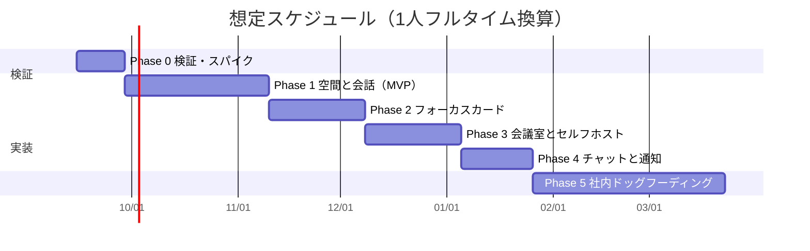

# 06. ロードマップとリスク

[02. 問題解決](./02-problem-solving.md) の6つの壁に対する解を、実際に作る順番に並べる。
各フェーズには **完了条件（DoD）** を置く。DoD を満たさないまま次に進まない。

---

## 1. 全体像

**Phase 2 がこのプロダクトの中核である**（[02 壁1](./02-problem-solving.md)）。
Phase 1 はその土台であって、主役ではない。順序を入れ替えないこと。

---

## 2. Phase 0 — 検証（2週間）

**作らない。測る。** ここを飛ばすと、以降の設計判断の根拠が消える。

| # | タスク | 目的 |
| --- | --- | --- |
| 0-1 | Gather と ovice を実際にチームで使う | **何日目に開かなくなるかを観測する**（[02 壁2](./02-problem-solving.md)） |
| 0-2 | WorkAdventure をセルフホストする | 「ゼロから作る」コストの実測。選択肢Aへの切り替え判断材料 |
| 0-3 | LiveKit のスパイク | room 作成・トークン発行・選択的購読の実装感を確認。**接続確立にかかる実測時間**を出す |
| 0-4 | TURN over TCP/443 の疎通確認 | UDP を塞いだ環境で通話が成立するかを実測（[02 壁5](./02-problem-solving.md)） |
| 0-5 | **低スペック実機の確保と 3D 描画ベンチ** | Core i5-8250U / 内蔵GPU / VDI で、low-poly + ベイク済み + 影なしの 3D が **30fps** を出せるかを実測。**3D 採用の可否をここで決める**（[02 §6](./02-problem-solving.md)） |
| 0-7 | 2D ビューのベンチ（比較対象） | 3D が届かなかった場合の受け皿として、同条件で 2D スプライト描画も測る |
| 0-8 | 3D アセットの調達方針の確認 | 既製 low-poly パックで初回DL 5MB / ドローコール100 未満に収まるかを試算 |
| 0-9 | **LiveKit E2EE のスパイク** | 音声 E2EE の CPU 負荷（低スペック端末）、simulcast の実際の制約、**鍵更新 API の実装コスト**、TURN/TLS 経由での動作を実測（[07 §10](./07-security.md)） |
| 0-6 | LiveKit のコスト実測 | 金額を確定させる（[04 §9](./04-architecture.md) は構造のみ確定済み） |

### Phase 0 の DoD

- [ ] 0-1 の観測結果が文書化されている（何日目に、なぜ開かなくなったか）
- [ ] WorkAdventure が自前環境で動いており、**選択肢 A / B の判断が下されている**
- [ ] UDP 全ブロック環境で LiveKit の通話が TURN/TCP 経由で成立することを確認済み
- [ ] **低スペック実機（内蔵GPU）で 3D が 30fps を維持できることを確認済み**
- [ ] **VDI 環境で 2D ビューへのフォールバックが機能することを確認済み**
- [ ] 3D が 30fps に届かない場合、**2D ビューを標準にして 3D を上位モードへ格下げする判断が下されている**
- [ ] 月額コストの概算が金額で出ている
- [ ] **音声 E2EE が低スペック端末で許容できる負荷で動くことを確認済み**
- [ ] E2EE 下での simulcast の制約が実測で確定している（公開情報のままにしない）

> **判断点**: 0-2 と 0-3 の結果次第で、方針を A（WorkAdventure ベース）に切り替えてよい。
> その場合 Phase 1 の大半が不要になり、Phase 2 から始められる。**切り替えは後退ではない。**

---

## 3. Phase 1 — 空間と会話（6週間）

MVP。ここまでで「歩いて、座って、話せる」。

| # | 実装 | 対応 |
| --- | --- | --- |
| 1-1 | Google Workspace OIDC 認証、ドメイン検証、組織・メンバー | M-01, M-02 |
| 1-2 | Realtime Gateway（WS、tick 10Hz、AOI フィルタ、TTL プレゼンス） | [04 §4](./04-architecture.md) |
| 1-3a | **論理レイヤー**（グリッド、当たり判定、エリア、席）と `SpaceRenderer` インターフェース | [04 §4.5](./04-architecture.md) |
| 1-3b | **2D ビュー実装**（PixiJS）— 先に作る。論理の検証用かつ縮退先 | M-17 |
| 1-3c | **3D ビュー実装**（Three.js、low-poly、ベイク済み、影なし、固定カメラ） | M-03, [04 §4.6](./04-architecture.md) |
| 1-3d | 解像度スケーリング（1.0x / 0.75x / 0.5x 自動調整） | M-16, [02 §6.4](./02-problem-solving.md) |
| 1-4b | アバター移動と補間（表現に依存しない共通処理） | M-04 |
| 1-4 | サーバ権威の移動検証（速度上限・壁の衝突） | [04 §5.3](./04-architecture.md) T4 |
| 1-5 | ステータス（自己申告4種） | M-05 |
| 1-6 | 着席通話（会話単位の LiveKit room、トークン発行） | M-06, [04 §5.2](./04-architecture.md) |
| 1-7 | ノック（承認・拒否・無反応） | M-07 |
| 1-8 | TURN (coturn) を TCP/443 で構築 | [02 壁5](./02-problem-solving.md) |
| 1-9 | **接続診断ツール** | M-18, [04 §10.3](./04-architecture.md) |
| 1-10 | **セキュリティ審査提出パッケージ・監査ログ仕様書** | [02 壁4](./02-problem-solving.md) |
| 1-11 | `AuditLog` モジュールと、enum 追加を検知する CI | [05 §3.6](./05-data-model.md) |
| 1-12 | **トークン発行の1モジュール集約とテスト** | [07 §7](./07-security.md)。**最大の実装リスク** |
| 1-13 | **音声の E2EE（既定 ON）** | M-09b, [07 §4](./07-security.md) |
| 1-14 | CSP / SRI / WS レート制限 | [07 §8](./07-security.md)。後付けが難しい |

### Phase 1 の DoD

- [ ] 5人が同時にフロアにいて、着席で会話ができる
- [ ] **想定最低スペックの実機**（Core i5-8250U / 内蔵GPU / 8GB / Excel・Teams 起動中）で
      **3D が 30fps・CPU 10%未満・メモリ 350MB 以内**
- [ ] ドローコール 100未満 / 三角形 150k未満 / テクスチャ 64MB未満 / 初回DL 5MB以内
- [ ] **WebGL を無効にしたブラウザで 2D ビューに落ちて動作する**
- [ ] **同じ論理データで 3D ビューと 2D ビューが同一の空間・位置・会話を再現する**
- [ ] **非通話時にブラウザのマイクインジケータが点灯していない**（[02 壁4](./02-problem-solving.md) の中核）
- [ ] UDP を塞いだネットワークで通話が成立する
- [ ] 非アクティブタブで CPU 使用率が実質 0
- [ ] 座標を偽装したクライアントが、遠くの会話 room のトークンを取得できない
- [ ] **音声が E2EE で流れており、SFU 側で復号できないことを確認済み**
- [ ] room トークンが他の room では使えず、5分で失効する
- [ ] トークンが localStorage に保存されていない
- [ ] 接続診断ツールが情シス向けレポートを PDF 出力できる
- [ ] 異常切断から30秒以内にゴーストアバターが消える

---

## 4. Phase 2 — フォーカスカード（4週間）

**このプロダクトの中核。** ここが機能しなければ、Phase 1 は「よくできた Gather の劣化版」でしかない。

| # | 実装 | 対応 |
| --- | --- | --- |
| 2-1 | フォーカスカードの作成・並べ替え・完了・持ち越し | M-10 |
| 2-2 | 「今週」タブを既定画面にする動線 | [03 §3.1](./03-features.md) |
| 2-3 | アバターに近づくとカードが吹き出しで見える | M-11 |
| 2-4 | 席にカードが置かれる（本人が居なくても） | [02 壁2-H2](./02-problem-solving.md) |
| 2-5 | 「詰まり」表示（プロジェクト単位・匿名） | M-12, [02 壁3](./02-problem-solving.md) |
| 2-6 | 朝のリマインド（1日1回のみ） | S-04 |
| 2-7 | **リストモード**（空間描画なし） | M-18, [04 §10.5](./04-architecture.md) |
| 2-8 | **低帯域モード / テキストモード** | M-20, M-21, [04 §10.4](./04-architecture.md) |
| 2-9 | チケットURL の読み取り展開 | S-03 |

### Phase 2 の DoD

- [ ] 朝のログインからカード更新完了までが **1分以内**で完結する
- [ ] **リストモードで、空間描画を一切使わずにプロダクトが成立している**
- [ ] **テキストモードで、通話機能を一切使わずにプロダクトが成立している**
- [ ] 「詰まり」の出力に `userId` が一切含まれていない（クエリを目視確認）
- [ ] 誰もログインしていない時間にフロアを開いても、各席にカードが見える

> 上2つの DoD が重要である。ここが通れば、壁5（回線）と壁6（PC性能）の
> 最終フォールバックが実証されたことになる。

---

## 5. Phase 3 — 会議室とセルフホスト（4週間）

| # | 実装 | 対応 |
| --- | --- | --- |
| 3-1 | 会議室エリア、ビデオグリッド、画面共有 | M-08 |
| 3-2 | プライベートルーム（招待制・ノック制・可視性設定）＋ **E2EE 強制と参加者増減時の鍵更新** | M-09, [04 §6](./04-architecture.md), [07 §4](./07-security.md) |
| 3-3 | 会議室予約 | S-02 |
| 3-4 | 会議室に参加者のカードを並べる | [03 §2.2](./03-features.md) |
| 3-5 | 会話後のタスク化提案（1度だけ） | S-05 |
| 3-6 | **セルフホスト一式（docker compose）と手順書** | S-08, [04 §10.1](./04-architecture.md) |
| 3-7 | プロジェクトボード（カンバン） | S-01 |

### Phase 3 の DoD

- [ ] **非参加者のクライアントに、プライベートルームのメディアが1バイトも届いていない**
      （ネットワークキャプチャで確認。UI で隠れているだけでは不合格）
- [ ] **退出した参加者が、退出後の会話を復号できない**（鍵更新の確認）
- [ ] `docker compose up` だけで全機能が動く構成が完成している
- [ ] セルフホスト構成で、外部インターネットへの通信が発生しない

---

## 6. Phase 4 — チャットと通知（3週間）

| # | 実装 |
| --- | --- |
| 4-1 | チャンネル / DM（M-13, M-14） |
| 4-2 | 「集中中」の通知保留と、解除時の一括表示 |
| 4-3 | 設定画面 / **「記録しないもの」ページ**（M-15） |
| 4-4 | エクスポート（S-07） |

### Phase 4 の DoD

- [ ] 「記録しないもの」ページの項目が、[05 §5](./05-data-model.md) の一覧と1対1で一致している
- [ ] 既読情報が他人に送信されていない（ネットワークタブで確認）

---

## 7. Phase 5 — 社内ドッグフーディング（8週間）

**ここが本当の検証である。** 8週間使い続けられなければ、機能を足しても解決しない。

測定するもの（[00 §6](./00-overview.md) の成功基準）:

| 指標 | 目標 |
| --- | --- |
| 週3日以上ログインする人の割合 | 60%以上 |
| 会議室**外**での会話セッション比率 | 30%以上 |
| 会話セッション長の中央値 | 10分未満 |
| フォーカスカードの週次更新率 | 70%以上 |
| 「集中中」ステータスの利用率 | **5%以上**（下回るなら原則2が心理的に機能していない） |

すべて個人を特定しない集計値として算出する（[05 §6](./05-data-model.md)）。

---

## 8. リスク登録簿

| # | リスク | 影響 | 確率 | 対策 |
| --- | --- | --- | --- | --- |
| R-1 | **8週間で使われなくなる** | 致命的 | 中 | Phase 0-1 で先行プロダクトの離脱を観測。フォーカスカードを中核に据える（[02 壁2](./02-problem-solving.md)）。Phase 5 で早期に判定 |
| R-2 | **情シス審査で止まる** | 致命的 | 中〜高 | Phase 1 で提出パッケージを用意。セルフホストを Phase 3 で提供。非通話時にマイクを掴まない設計（[02 壁4](./02-problem-solving.md)） |
| R-3 | **企業ネットワークで動かない** | 高 | 中〜高 | TURN/TCP 443 を必須構成に。接続診断ツール。テキストモード（[02 壁5](./02-problem-solving.md)） |
| R-4 | **業務PCで 3D が重くて使えない** | 高 | **中〜高**（3D 採用で上昇） | 論理と表現の分離により 2D ビュー／リストモードへ縮退できる。30fps上限・影なし・ベイク済み・固定カメラ・解像度スケーリング。**Phase 0 のベンチで採用可否を判断**（[02 §6](./02-problem-solving.md)） |
| R-11 | **3D アセットの制作コストが想定を超える** | 中 | 中 | アバターはプリセット固定、家具は共通パーツ＋インスタンシング、既製 low-poly パックを起点にする |
| R-12 | **3D 実装で Phase 1 が延びる** | 中 | 中〜高 | 1-3b（2D ビュー）を先に作り、論理を先に固める。3D が間に合わなければ 2D で Phase 2 に進める |
| R-13 | **room トークンの誤発行** | **致命的** | 中 | 暗号が正しくても、間違った人にトークンを出せば全部無意味になる。発行経路を1本に集約し、テストを必須にする（[07 §7](./07-security.md)） |
| R-14 | E2EE の負荷が低スペック端末で許容できない | 中 | 低〜中 | Phase 0 で実測。音声のみなら負荷は小さい見込み。届かなければプライベートルーム限定に縮退 |
| R-15 | E2EE 下の simulcast 制約が想定より重い | 中 | 中 | 音声には影響しない。映像は組織設定で E2EE を選択可能にしてある |
| R-5 | フォーカスカードが書かれない | 高 | 中 | 朝1分の動線、既定タブ、チェックイン時刻の合意。書かせる強制はしない |
| R-6 | WebRTC の運用難度を過小評価していた | 高 | 中 | Phase 0 のスパイクで実測。詰まったら選択肢A（WorkAdventure ベース）へ切り替え |
| R-7 | メディアのコストが想定を超える | 中 | 低〜中 | 既定ビデオOFF、会話単位の接続。Phase 0 で実測 |
| R-8 | **原則が実装中に骨抜きになる** | 高 | **中〜高** | `AuditAction` の enum 追加と「作らないテーブル」の追加を CI で検知（[05 §8](./05-data-model.md)）。設計ドキュメントの更新なしにマージしない |
| R-9 | Safari で動かない | 中 | 中 | Phase 1 から Safari を CI の対象に含める |
| R-10 | 1人開発で Phase 5 まで到達しない | 中 | 高 | Phase 2 終了時点で最小の価値が出る構成にしてある。そこで止めても使えるものが残る |

**R-8 に注意すること。** 6つの壁への解の多くは「作らない」という判断で成り立っており、
作らない判断は、実装中に「便利だから」という理由で簡単に覆る。
仕組み（CI）で守らなければ必ず崩れる。

---

## 9. 判断が必要な未決事項

| # | 論点 | 期限 |
| --- | --- | --- |
| O-1 | 選択肢 A（WorkAdventure ベース）/ B（ゼロから）の最終決定 | Phase 0 終了時 |
| O-2 | LiveKit を Cloud で始めるかセルフホストで始めるか | Phase 0 終了時 |
| O-3 | フォーカスカードの週の区切り（月曜固定か組織設定か） | Phase 2 前 |
| O-4 | 「詰まり」の閾値 3日 が妥当か | Phase 5 で検証 |
| O-5 | チャットを本気で作るか、Slack 併用を許容するか | Phase 4 前 |
| O-6 | 位置のバイナリプロトコルの具体形式 | Phase 1 前半 |
| O-8 | **3D を標準にするか、2D を標準にして 3D を上位モードにするか** | **Phase 0 終了時（ベンチの数字で決める）** |
| O-9 | 3D の画づくり（low-poly の作風、アセットの調達元） | Phase 1 前半 |
| O-10 | 通常の会議室の映像で E2EE を既定 ON にするか（simulcast とのトレードオフ） | Phase 0 の実測後 |
| O-7 | プロダクト名（現在は仮称 Hidamari） | Phase 2 まで |
