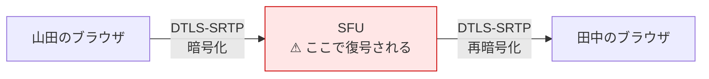

# 07. 接続の安全性

「音声・映像がネットワークを流れる」プロダクトである以上、
**どの経路で、何が、誰に見えるのか**を1つずつ確定させる必要がある。

結論を先に書く。

> **弱点は1箇所しかない。SFU（メディアサーバ）が音声・映像を復号できる点である。**
> ここに3つの答えを重ねる: **セルフホスト**、**E2EE**、**プライベートルームでのE2EE強制**。
> その他の経路（TURN リレー、シグナリング、位置同期）は、誤解されがちだが構造的に安全である。

---

## 1. 経路ごとに「誰が中身を見られるか」

| 経路 | 保護 | 中身を見られる者 |
| --- | --- | --- |
| ブラウザ ↔ Web / API | TLS 1.3 (HTTPS) | アプリサーバ（当然。タスクやチャットを扱うため） |
| ブラウザ ↔ Gateway（位置・状態） | TLS (wss/443) | Gateway。ただし**見えるのは座標とステータスだけ**で、会話の中身ではない |
| ブラウザ ↔ **TURN リレー** | TLS (TURNS/443) + DTLS-SRTP | **誰も見られない**（§2） |
| ブラウザ ↔ **SFU**（E2EE なし） | DTLS-SRTP | **SFU が復号できる** ← **唯一の弱点**（§3） |
| ブラウザ ↔ **SFU**（E2EE あり） | DTLS-SRTP + フレーム単位の暗号 | **誰も見られない**（§4） |

---

## 2. よくある誤解: 「TURN を経由すると中身を見られる」

**見られない。**

WebRTC のメディアは **DTLS-SRTP** で保護されており、
その鍵交換と暗号化・復号は **端点（ブラウザ）でのみ**行われる。
TURN サーバは暗号化されたパケットをそのまま中継するだけで、鍵を持たない。

つまり [02 壁5](./02-problem-solving.md) で「必須構成」とした **TURN over TCP/443 は、安全性を落とさない**。
落ちるのは遅延と帯域効率だけである。

さらに、DTLS-SRTP の鍵素材は **JavaScript からも取り出せない**（ブラウザ内部が保持する）。
アプリのコードが漏れても鍵は漏れない。

---

## 3. 唯一の弱点: SFU は復号できる

グループ通話のために SFU（メディアサーバ）を経由する構成では、
**暗号化が SFU で一度終端する**。SFU が受信ストリームを復号し、再暗号化して転送する。

これは LiveKit 固有の問題ではなく、**SFU 方式そのものの性質**である。
Zoom も Gather も、SFU/MCU を使う限り原理的に同じ構造を持つ。

「プライベート会議室」を謳う以上、ここを放置はできない。3つの答えを重ねる。

---

## 4. 答え1: E2EE（SFU にも読ませない）

LiveKit は **Insertable Streams（Encoded Transforms）** を用いた E2EE をサポートする。
メディアフレームを WebRTC のパイプラインに入る前に暗号化するため、
**SFU が扱うのは常に暗号化されたバイト列**になる。SFU が侵害されても中身は読めない。

### 制約と、本プロダクトがそれをほぼ払わずに済む理由

E2EE を有効にすると、SFU は中身を読めないため次ができなくなる。

| E2EE で失う機能 | 本プロダクトへの影響 |
| --- | --- |
| サーバサイド録画（Egress） | **影響なし。録画を作らない**（[03. Won't](./03-features.md)） |
| サーバサイド文字起こし | **影響なし。作らない** |
| MCU（サーバ側で映像をグリッド合成） | **影響なし。クライアント側でレイアウトする** |
| トランスコード | **影響なし。必要としない** |
| **simulcast レイヤーの切り替え** | **影響あり**（下記） |

> **「録画しない・文字起こししない」という [00. 原則3](./00-overview.md) 由来の判断が、
> E2EE の代償をほぼ帳消しにしている。**
> 一般的なビデオ会議 SaaS が E2EE を既定にできないのは、これらの機能を売りにしているからである。
> 本プロダクトはそれらを最初から作らないと決めているため、E2EE を採りやすい立場にある。

### 唯一残る代償: simulcast

E2EE 下では SFU が映像の品質レイヤーを選べなくなるとされる。
これは **回線が細い参加者に合わせて自動で画質を落とす**仕組みであり、
[02 壁5](./02-problem-solving.md)（企業ネットワーク）と衝突する。

**音声には影響しない。** そして本プロダクトの既定は音声のみである。

### したがって、こう決める

| 対象 | E2EE | 理由 |
| --- | --- | --- |
| **音声（既定・常用）** | **常に ON** | 代償がない。日常の会話はすべて E2EE になる |
| **プライベートルーム** | **常に ON（強制・解除不可）** | [00. 原則5](./00-overview.md)。ここで妥協したら「プライベート」を名乗れない |
| 通常の会議室の映像 | 組織設定で選択（既定 ON） | 回線が厳しい組織は OFF にして simulcast を取れる |

> **Phase 0 で確認すること**: E2EE 下での simulcast の実際の制約と、
> 鍵配布 API の実装可能性。ここは公開情報だけで確定させず、実測する（[06. ロードマップ](./06-roadmap.md)）。

### 鍵配布 — ここでも room = 会話単位が効く

E2EE の最難関は「誰に鍵を渡すか」である。これは
**「誰がこの会話に参加してよいか」と同じ問題**であり、[04 §5.3](./04-architecture.md) で既に解いてある。

- room が会話単位なので、**鍵も会話単位**でよい（フロア全体の巨大な鍵共有にならない）
- 鍵を受け取れるのは、Gateway が入室を承認した参加者だけ
- **参加者が増減したら鍵を更新する**（退出した人が以後の会話を復号できないようにする）

---

## 5. 答え2: セルフホスト（復号する主体を自社にする）

E2EE を使わない構成（あるいは E2EE の制約を避けたい場合）でも、
**SFU が自社の VPC / オンプレにあるなら、復号するのは自社のサーバ**である。
「社外の誰かが聞けるかもしれない」という問題そのものが消える。

これは [02 壁4](./02-problem-solving.md) の解3 と同じ手であり、
セキュリティ・データレジデンシー・回線の3つに同時に効く。

構成要素をすべて OSS で選定した（[04 §2](./04-architecture.md)）のは、この選択肢を残すためである。

---

## 6. 答え3: P2P にしなかったことが、プライバシーに効いている

見落とされがちな利点がある。

素の P2P（メッシュ）では、ICE の過程で **相手に自分のグローバル IP アドレスが渡る**。
在宅勤務なら、**自宅の IP アドレスが同僚に見える**ということである。

本プロダクトは [04 §5.1](./04-architecture.md) の通り SFU 方式であり、
各クライアントの ICE 候補は SFU（または TURN）のアドレスに解決される。
**参加者同士は互いの IP を知らない。**

N² 問題を避けるために選んだ SFU が、そのままプライバシー対策になっている。

---

## 7. シグナリングとトークン

メディアの暗号化が完璧でも、**入室の判定が甘ければ意味がない**。

| 項目 | 方針 |
| --- | --- |
| シグナリング経路 | wss (443) のみ。TLS 必須 |
| room トークン | **その room 限定・短命（5分、会話中は更新）** の JWT。漏れても他の room には使えない |
| トークンの保存 | **localStorage に置かない。** メモリ保持のみ。リロード時は再取得 |
| セッション | Cookie は `HttpOnly` / `Secure` / `SameSite=Lax` |
| 発行経路 | **トークン発行を1モジュールに集約**し、そこ以外から発行できないようにする |
| 組織の検証 | クライアントが送る `orgId` を信用しない。**常にセッションから引く** |
| 入室判定 | Gateway が位置・席の空き・相手のステータス・エリア権限を検証（[04 §5.3](./04-architecture.md)） |

**トークン誤発行が、この設計における最大の実装リスクである。**
暗号は正しくても、間違った人にトークンを出せば全部が無意味になる。
発行経路を1本にし、その1本に対するテストを必須にする。

---

## 8. その他の攻撃面

| 攻撃 | 対策 |
| --- | --- |
| 座標偽装による盗聴 | サーバが位置の権威。クライアントの申告を信じない（[04 §5.3](./04-architecture.md)） |
| プライベートルームの覗き見 | 非参加者にトークンを発行しない＝配信経路が存在しない（[04 §6](./04-architecture.md)） |
| XSS（チャット・タスク経由） | React のエスケープ + 保存時サニタイズ + **CSP**（`script-src` を自ドメインに限定、`unsafe-inline` 禁止） |
| CSRF | SameSite Cookie + Origin 検証 |
| WS の DoS / リソース枯渇 | per-connection トークンバケット。位置は 15Hz 超で切断。room 作成数に上限 |
| 総当たり・大量ノック | ノックのレート制限。同一相手への連続ノックを抑制 |
| サプライチェーン（npm・3Dアセット） | 依存を最小化。lockfile 固定。**SRI**。3Dアセットは自ドメイン配信（CDN 依存を増やさない） |
| 退職者のアクセス継続 | `deactivatedAt` で即時遮断。SCIM 対応（[03. S-09](./03-features.md)）。トークンが短命なので最大5分で失効 |

---

## 9. 正直に認める限界

**「安全性を確保した」と言い切れない部分**を明記しておく。
ここを曖昧にすると、セキュリティ審査で信頼を失う。

| 限界 | 実態 | 緩和 |
| --- | --- | --- |
| **E2EE でもメタデータは隠せない** | 「誰がいつどの room にいたか」はサーバに見える | **保存しない**設計なので記録として残らない（[05 §5](./05-data-model.md)）。ただし運用者がリアルタイムに観測することは原理的に可能 |
| **ブラウザ E2EE は配信される JS に依存する** | サーバが改竄した JS を配れば、E2EE は無意味になる | CSP・SRI・依存の最小化。**ただし完全な解決策は存在しない**。これはブラウザ製品すべてに共通する構造的限界 |
| **SaaS 形態では運用者を信頼する必要がある** | E2EE を使っても上記の限界が残る | **セルフホストを主要な導入形態として提供する**（§5） |
| **端末が侵害されたら無意味** | マルウェア・画面録画には何をしても勝てない | 対象外。端末管理は顧客側の責務 |
| 通話中の「録画されていないこと」は証明できない | 参加者が別ソフトで画面録画することは防げない | どの会議ツールも同じ。制度で扱う問題 |

**言えること**: 「盗聴されない」ではなく、
**「正規の参加者以外は復号できず、参加者の判定はサーバが権威を持ち、記録は残らない」**。

---

## 10. 実装の優先順位

| # | 項目 | フェーズ | 理由 |
| --- | --- | --- | --- |
| 1 | トークン発行の集約とテスト | Phase 1 | 最大の実装リスク（§7） |
| 2 | サーバ権威の入室判定 | Phase 1 | 座標偽装対策（既に設計済み） |
| 3 | TURN over TLS/443 | Phase 1 | 壁5 と両立（§2） |
| 4 | **音声の E2EE** | **Phase 1** | 代償がない。最初から入れる |
| 5 | CSP / SRI / レート制限 | Phase 1 | 後付けが難しい |
| 6 | **プライベートルームの E2EE 強制** | Phase 3 | 原則5 の実装（§4） |
| 7 | セルフホスト一式 | Phase 3 | §5 |
| 8 | SCIM | Phase 4 以降 | 情シス要件 |

### Phase 0 で確認すること

- [ ] LiveKit の E2EE を音声で有効にした場合の、実際の CPU 負荷（低スペック端末で測る）
- [ ] E2EE 下での simulcast の実際の制約（公開情報だけで確定させない）
- [ ] 参加者の増減に伴う**鍵更新**の API と、その実装コスト
- [ ] TURN over TLS/443 経由でも E2EE が問題なく動作すること

---

## 出典

- [LiveKit — Encryption overview](https://docs.livekit.io/transport/encryption/)
- [LiveKit — E2EE リファレンス](https://docs.livekit.io/reference/python/v1/livekit/rtc/e2ee.html)
- [WebRTC Security: DTLS-SRTP, Encryption, and Token Authorization](https://antmedia.io/webrtc-security/)
- [WebRTC Security in 2026: E2EE, HIPAA & Attacks](https://www.forasoft.com/blog/article/webrtc-security-in-plain-language-495)
- [WebRTC Security: DTLS, SRTP, Fingerprints, Identity](https://www.forasoft.com/learn/video-streaming/articles-streaming/webrtc-security-dtls-srtp)
