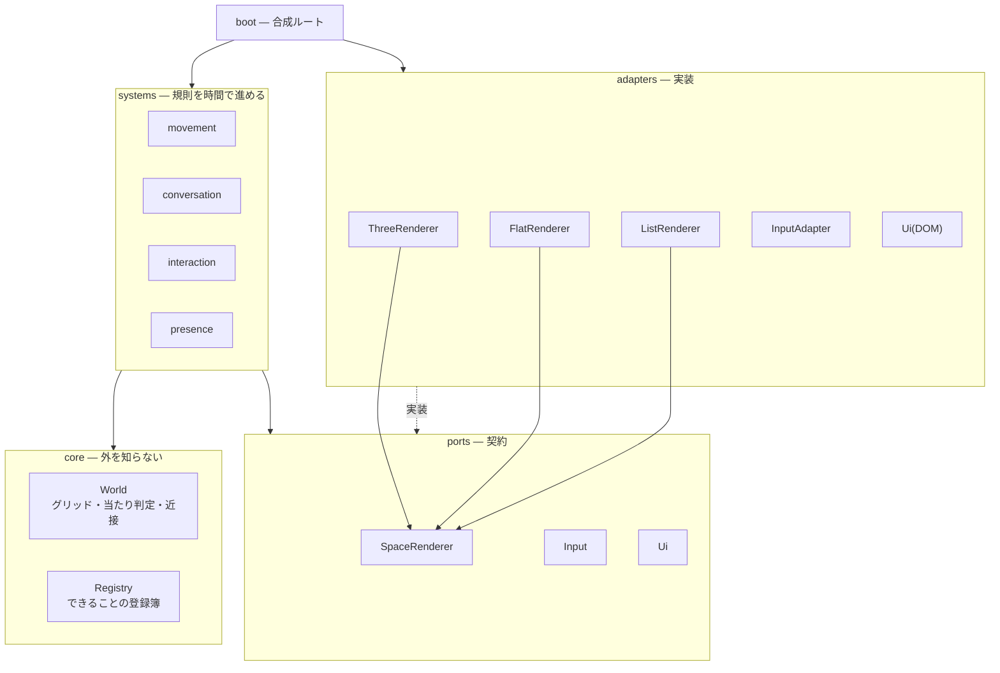

# 08. 拡張のしかた — 配線と、できることの増やし方

このドキュメントは2つのことを決める。

1. **配線**: モジュールをどう繋ぐか。ここを決めないと、機能を足すたびに全体が壊れる
2. **拡張点**: 「できること」をどこに足すのか。Gather 的な広がりを、破綻させずに増やす道筋

---

# Part 1 — 配線

## 1. なぜ配線を先に決めるのか

このプロダクトは **3つの表現（3D / 2D / リスト）× 増え続けるオブジェクト × 増え続ける相互作用** を抱える。
素直に書くと、オブジェクトを1つ足すたびに3箇所（3Dの描画・2Dの描画・リストの表示）と
入力処理を触ることになり、掛け算で破綻する。

配線の目的は **「1つ足すときに触る箇所を1箇所にすること」** である。

## 2. 層



**依存は常に外→内。** `World` は Three.js も DOM も知らない。
逆向きの依存が1本でも生まれたら、そこが後で必ず詰まる。

| 層 | 置くもの | 置かないもの |
| --- | --- | --- |
| `core` | 盤面の規則、純粋関数、登録簿 | DOM、Three.js、fetch、setTimeout |
| `systems` | 時間で進む処理、状態遷移 | 描画、DOM 操作 |
| `ports` | 契約（インターフェース）だけ | 実装 |
| `adapters` | 描画・入力・UI・（将来）通信・メディア | 業務ルール |
| `boot` | 全部を繋ぐ配線。ここだけが全部を知る | ロジック |

## 3. 状態の置き場所を3つに分ける

**これが最も間違えやすい。** 混ぜると、毎フレーム UI が再描画されるか、
逆に変化が UI に伝わらないかのどちらかになる。

| 置き場所 | 何を置くか | 変化の頻度 | 購読 |
| --- | --- | --- | --- |
| **`World`** | 座標、向き、NPC の位置 | **毎フレーム** | **しない**（レンダラが直接読む） |
| **`Store`** | ステータス、会話、表示モード、画面 | 離散的 | UI が購読する |
| **`Bus`** | 座った・ノックした・切り替えた | 一回きり | UI が受けてトーストを出す |

一般に言われる「**状態はストア、出来事はバス**」に、
リアルタイム描画の事情から **「毎フレーム変わるものはストアに載せない」** を足した形である。

座標をストアに入れて購読させると、60Hz で全 UI が再描画されて即座に破綻する。
逆に「席に座った」をストアのフラグだけで表すと、
**同じ席に座り直したときに何も起きない**（値が変わらないので通知が飛ばない）。
だから出来事はバスに流す。

## 4. ポート: `SpaceRenderer`

3つの表現が満たす契約。**これがあるから、3D → 2D → リストの縮退が成立する**
（[02 §6.5](./02-problem-solving.md)）。

```ts
interface SpaceRenderer {
  mount(host: HTMLElement): void
  render(now: number): void       // World を直接読む。引数で状態を渡さない
  resize(w: number, h: number): void
  stats(): { calls: number, tris: number }
  unmount(): void
}
```

`render()` に状態を渡さないのが要点である。渡す形にすると、
表現が増えるたびに「何を渡すか」を決め直すことになる。
**World は誰でも読める前提**にして、レンダラ側が必要な分だけ読む。

## 5. 合成ルート

`boot()` だけが `Systems`・`Registry`・各アダプタの全部を知っている。
逆に言えば、**`boot()` 以外のどこにも「相手の実体」を書かない**。

- `Systems.conversation` は「トーストを出す」を知らない。`Bus.emit(EV.SAT)` するだけ
- トーストを出すのは `boot()` の `Bus.on(EV.SAT, ...)` 1行
- テストするときは `boot()` を呼ばなければ、core と systems だけを動かせる

---

# Part 2 — できることの増やし方

## 6. Gather から学ぶ「拡張点」

Gather は空間に **オブジェクト**を置き、それぞれに **相互作用の種別**を割り当てる方式をとっている
（埋め込みウェブサイト / 画像 / 動画 / 外部通話へのリンク / メモ）。
利用者は近づいて 1つのキーを押すだけで、種別に応じた挙動が起きる。

**学ぶべきはオブジェクトの品揃えではなく、この構造である。**

> **「置いてあるもの」と「1つの動詞」に分解すれば、
> 機能追加はオブジェクト種別を1つ足すことになる。**

## 7. 本プロダクトの拡張点: `Registry`

オブジェクト種別を1箇所に登録する。**登録した瞬間に3表現すべてに出る。**

```js
Registry.define('note', {
  action({ obj, store, world }) {          // いま押せるか、押したら何が起きるか
    return { label:'読む', sub:'貼り紙', run: () => Ui.overlay(obj.data.title, obj.data.body) }
  },
  build3d(obj, mat, THREE) { /* THREE.Object3D を返す */ },
  draw2d(obj, ctx, transform) { /* Canvas2D に描く */ },
  listRow(obj) { /* リスト表示の1行 HTML */ },
})
```

- 4つとも省略可能。`action` だけなら見えないトリガー、`build3d` だけなら飾り
- **`World` は種別の中身を知らない。** `{ id, kind, x, y, data }` しか持たない
- レンダラも種別を知らない。`Registry.get(kind).draw...` を呼ぶだけ

プロトタイプには現在 `seat` / `note` / `board` の3種類が入っている。
`board`（チームの今週ボード）は、この仕組みが飾りでないことを示すために入れた
実機能である — 近づいて「見る」と全員のフォーカスカードと詰まり件数が出る。

## 8. 相互作用の語彙を増やさない

**動詞は1つに保つ。**「使う」（PC は `E`、スマホは丸ボタン）。
何が起きるかは、いま届く範囲にあるものが決める。

```
Systems.interaction.resolve()
  1. 会話中          → 「立つ / 終える」
  2. ノックの返事待ち → 押せない
  3. 届く範囲のオブジェクト → Registry の action()
  4. 近接している人   → 「ノック」
  5. なし            → 押せない
```

UI（キーボード・丸ボタン・下部バー）は **この関数の戻り値しか見ない**。
オブジェクト種別を足しても、UI 側は1行も変わらない。

> Gather が「x キー1つ」で everything をまかなっているのは、
> ボタンを節約しているのではなく、**拡張の入口を1つに絞っている**からである。

## 9. できることのはしご（Capability Ladder）

一度に全部作らない。**各段は、前の段の拡張点だけを使って足せること**を条件にする。
条件を満たさない段が出てきたら、そこで配線を見直す合図である。

| 段 | できること | 足すもの | 新しい配線 | 実装 |
| --- | --- | --- | --- | --- |
| **L0** | 歩く・近づく・座る・ノック・カードを見る | — | — | ✅ |
| **L1** | 貼り紙、チームのボード、案内板、観葉植物 | `Registry` に種別 | **不要** | ✅ |
| **L2** | ドア、複数フロア（部屋 ⇄ ラウンジ） | `Registry` + `World` に複数フロア | `rebuild()` 1本 | ✅ |
| **L3** | 実際のマイク | `Media`（ポート追加） | **ポート1本** | ✅ 自分のマイクのみ |
| **L4** | 他人がリアルタイムに動く | `Net`（ポート追加） | **World の更新経路** | ✅ presence 経由 |
| **L5** | ホワイトボード | `Registry` に種別（中身は `DB`） | 不要 | ✅ |
| **L6** | 会議室の予約 | `Registry` に種別（中身は `DB`） | 不要 | ✅ |
| **L7** | 保存物の E2EE | `Crypto` を `DB` の手前に挟む | 不要 | ✅ ホワイトボード |

**L3 と L4 だけが新しいポートを要求した。** 予想どおりで、それ以外は
`Registry` に足すだけで済んだ。設計の狙いが実装で確認できた形になる。

### 実装してみて分かったこと（プロトタイプ `prototype/index.html`）

| 段 | 予想 | 実際 |
| --- | --- | --- |
| L1 | 配線の追加なし | **そのとおり。** `Registry.define()` を4回呼んだだけ |
| L2 | 「フロアの切替のみ」 | **`SpaceRenderer` に `rebuild()` を1本足した。** 静的な形を作り直す必要があるため。契約が1つ増えたが、3実装とも数行 |
| L3 | ポート1本 | **そのとおり。** `Media.acquire()/release()` を `Systems.conversation` から呼ぶだけ。**着席・離席以外からは呼ばれない**ので、[02 壁4](./02-problem-solving.md) の「通話中だけマイクを掴む」がコードの形として保証される |
| L4 | World の更新経路が変わる | **レンダラは1行も変わらなかった。** `World.actors()` が NPC と実在の人を混ぜて返すようにしただけ。`render()` に状態を渡さない設計の見返りがここで出た |
| L5〜L7 | 不要 | **そのとおり。** ただし保存先（`DB`）が新しいアダプタとして必要だった |

**予想が外れたのは L2 だけ**（`rebuild()` の追加）。
外れ方が小さいので、配線の粒度はおおむね正しかったと判断してよい。

### プロトタイプで「本物」なもの・「本物でない」もの

正直に分けておく。

| 本物 | 本物でない |
| --- | --- |
| **マイクの取得**（`getUserMedia`）。OS の表示で確認できる | **相手の音声**。SFU が要る（[04 §5](./04-architecture.md)） |
| **他の人の位置**（同じページを開いている人が実際に動く） | サーバ権威。いまは各クライアントが自分の座標を主張している |
| **ホワイトボードの共有と永続化** | — |
| **E2EE**（AES-GCM。共有ストアには暗号文しか残らない） | **鍵配布**。いまはボードIDから導出。実運用では Gateway が参加者にだけ配る（[07 §4](./07-security.md)） |
| **会議室の予約** | — |
| NPC の同僚 | 台本どおりに動くだけ |

### L4 で World の扱いが変わる点だけ、先に決めておく

いまは `World.me` をクライアントが直接動かしている。
ネットワークが入ると、**権威はサーバに移る**（[04 §5.3](./04-architecture.md)）。

そのとき変わるのは `Systems.movement` の1関数だけになるようにしてある。

```js
// L0〜L3（いま）
World.resolveMove(dx, dy, sp)                  // 自分で確定させる

// L4 以降
Net.sendIntent(dx, dy)                          // 動きたいという意思を送る
Net.onTick(frame => World.applyAuthoritative(frame))  // 確定した座標を受ける
```

レンダラは `World` を読むだけなので、**この変更の影響を受けない。**
これが「render() に状態を渡さない」ことの見返りである。

## 10. 足すときの手順

新しい「できること」を足すときは、この順で判断する。

1. **`Registry` に種別を1つ足して済むか?** → 済むなら足して終わり
2. 済まないなら、**新しいポートが要るか?**（外の世界と繋がるか）
   → 要るならポートを定義し、アダプタを1つ書く。core と systems は触らない
3. それでも済まないなら、**規則そのものが増えている**
   → `systems` に1つ足す。ここまで来たら設計ドキュメントも更新する

**3 に到達する頻度が上がってきたら、配線が現実と合わなくなっている合図である。**

## 11. 意図的に拡張しないもの

拡張点があることは、何でも足してよいという意味ではない。
[03. Won't](./03-features.md) は拡張点の上にも効く。

| 足せるが足さない | 理由 |
| --- | --- |
| 個人の稼働を表示するオブジェクト | [00. 原則3](./00-overview.md) |
| 通話を録画するオブジェクト | 原則3。E2EE も壊す（[07 §4](./07-security.md)） |
| ミニゲーム、装飾アイテム | 目新しさは定着率を解かない（[02 壁2-H1](./02-problem-solving.md)） |
| 近接で自動再生される音・動画 | [00. 原則1](./00-overview.md)。押して初めて起きる |

---

## 出典

- [Gather — Objects Overview](https://support.gather.town/hc/en-us/articles/15910376994708-Objects-Overview)
- [Gather — Interactive Objects](https://support.help.gather.town/articles/5512361772-interactive-objects)
- [Gather — Embedded Websites](https://support.gather.town/hc/en-us/articles/15910417713940-Embedded-Websites)
- [Ports and Adapters (Hexagonal Architecture)](https://8thlight.com/insights/a-color-coded-guide-to-ports-and-adapters)
- [Event-Driven on the Frontend: Why We Miss an Event Bus](https://dev.to/artstesh/event-driven-on-the-frontend-why-we-miss-an-event-bus-4oh3)
- [Building a Game Loop: Architecture, Internals, and Best Practices](https://www.codingpancake.com/2026/07/building-game-loop-architecture.html)
