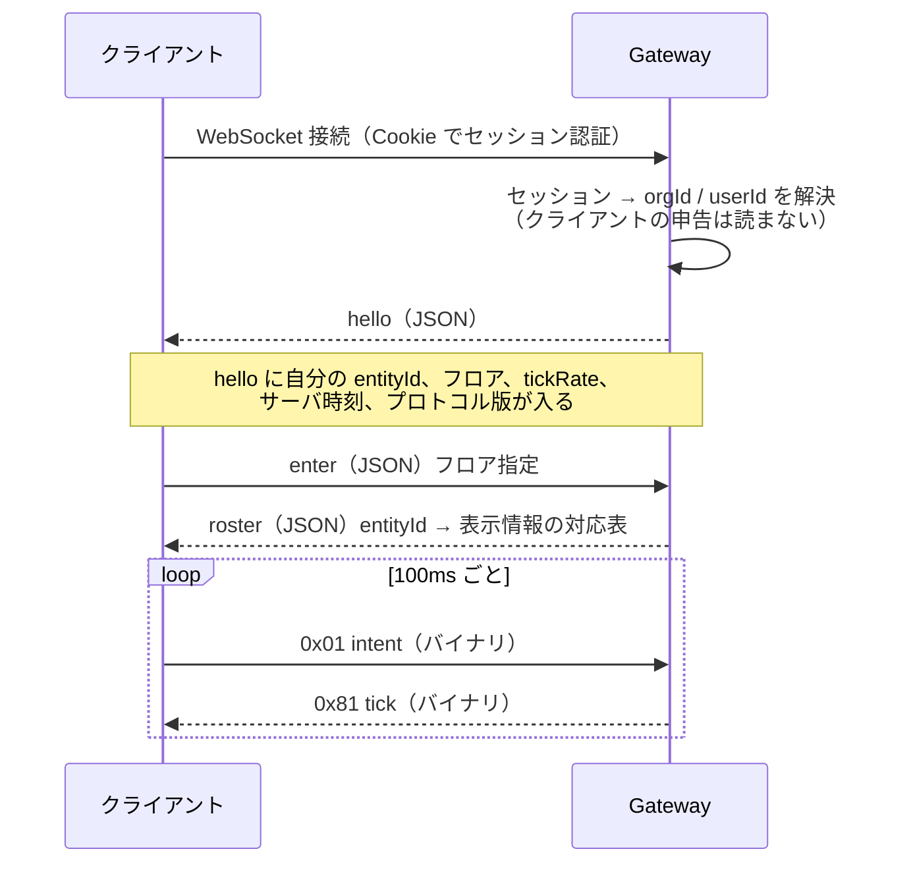

# 09. ワイヤプロトコル仕様

[04 §3](./04-architecture.md) で3つのチャネルに分けると決めた。
この文書はそのうち **A（位置）と B（状態）の具体形式**を確定させる。

[06 O-6](./06-roadmap.md)「位置のバイナリプロトコルの具体形式」への回答であり、
**未決のまま Phase 1 に入ると必ず手戻りする**ため先に決める。

C（永続データ）は通常の REST なので、ここでは扱わない。

---

## 1. 範囲と前提

| | |
| --- | --- |
| 対象 | クライアント ⇄ Realtime Gateway |
| 転送 | 単一の WebSocket（`wss://`、443）。A と B を多重化する |
| 権威 | **サーバ**。クライアントは意思を送るだけで、座標を主張できない（[04 §5.3](./04-architecture.md)） |
| 文字 | B の JSON は UTF-8 |
| バイト順 | **ビッグエンディアン**（`DataView` の既定に合わせる） |

### 多重化

1フレームの先頭1バイトで種別を判別する。

| 上位ビット | 意味 |
| --- | --- |
| `0x0_` | クライアント → サーバ（バイナリ） |
| `0x8_` | サーバ → クライアント（バイナリ） |
| テキストフレーム | チャネル B（JSON）。WebSocket のフレーム種別で分ける |

**バイナリとテキストを WebSocket のフレーム種別で分けるので、
B に1バイトのタグは要らない。**

---

## 2. 接続とハンドシェイク



**`orgId` と `userId` はセッションから引く。** クライアントが送ってきた値は読まない。
これは [07 §7](./07-security.md) の「クライアントが送る組織IDを信用しない」の実装である。

---

## 3. チャネル A — 位置（バイナリ）

### 3.1 なぜバイナリか

JSON だと1人あたり 60〜80 バイト。20人分を 10Hz で送ると 12〜16 kB/s。
バイナリなら 8 バイト/人なので **約 1/8** になる。
[03 非機能要件](./03-features.md) の「アイドル上り 10kbps 未満」はこの差で達成する。

### 3.2 クライアント → サーバ: `0x01 intent`

**10 バイト固定。** 送信は 10Hz（上限 15Hz、超えたら §5.3 で切断）。

```
オフセット  型     フィールド     意味
0          u8     tag           0x01
1          u16    seq           連番。ラップする（65535 の次は 0）
3          i8     dx            進みたい向き X。-127..127 を -1.0..1.0 に写す
4          i8     dy            進みたい向き Y。同上
5          u8     flags         bit0: 走る（予約）  bit1-7: 予約
6          u32    clientTime    クライアントの単調時刻(ms)。RTT 推定用
```

- **座標を送らない。** 送るのは「この向きに進みたい」という意思だけ
- `seq` は後述の**巻き戻し照合**に使う
- `dx=dy=0` でも送る（生存確認とRTT推定を兼ねる）

### 3.3 サーバ → クライアント: `0x81 tick`

**ヘッダ 10 バイト + 8 バイト × 人数。** 100ms ごと。

```
ヘッダ
オフセット  型     フィールド     意味
0          u8     tag           0x81
1          u32    tick          サーバの tick 番号
5          u16    ackSeq        このクライアントから最後に処理した intent の seq
7          u16    count         続くエントリ数
9          u8     flags         bit0: このフレームは自分の位置の補正を含む

エントリ（count 個）
オフセット  型     フィールド     意味
0          u16    entityId      フロア内で一意。roster で表示情報と対応づく
2          u16    x             タイル座標 × 256（固定小数）。0..255.996 タイル
4          u16    y             同上
6          u8     dir           向き。0..255 を 0..2π に写す
7          u8     state         bit0-2: ステータス(4種+予備)
                                bit3:   着席中
                                bit4:   通話中
                                bit5:   ノック待ち
                                bit6-7: 予備
```

### 3.4 帯域の実測見込み

```
ヘッダ 10 + 8 × 20人 = 170 バイト/フレーム
170 × 10Hz = 1.7 kB/s = 約 13.6 kbps （下り）
上り: 10 バイト × 10Hz = 0.8 kbps
```

**AOI（§3.5）で 20人に絞った場合の値。**
アイドル時（誰も動いていない）は §3.6 の差分抑制でさらに下がる。

### 3.5 AOI — 誰を送るか

フロアを 16×16 タイルのセルに分割し、Redis に在室者を持つ。
**自分のセルと隣接8セルにいる人だけ**を tick に含める。

- 80人の組織でも、1人が同時に見るのは通常 10〜25人
- セルをまたいだ瞬間に entityId が増減する → クライアントは知らない id を
  受け取ったら roster を要求する（§4.4）

### 3.6 差分抑制

- 前回の tick から **x, y, dir, state のいずれも変わっていない entity は含めない**
- 変化が無い人も **2秒に1回は必ず含める**（取りこぼしの自己修復）
- 誰も動いていないフロアでは tick が空になり、ヘッダ 10 バイトだけになる

---

## 4. チャネル B — 状態（JSON テキスト）

離散的な出来事。順序と到達が要る。

### 4.1 サーバ → クライアント

| `t` | 内容 |
| --- | --- |
| `hello` | `{selfEntityId, floor, tickRate, serverTime, protocol}` |
| `roster` | `{add:[{entityId, userId, name, color, body}], remove:[entityId]}` |
| `status` | `{entityId, status}` 誰かのステータスが変わった |
| `seat` | `{entityId, seatId \| null}` 着席・離席 |
| `knock` | `{fromEntityId}` ノックされた |
| `knockResult` | `{targetEntityId, accepted}` |
| `conv` | `{convId, room, token, expiresAt, members:[entityId]}` 会話が始まった |
| `convEnd` | `{convId}` |
| `floor` | `{floor, spawn:{x,y}}` フロアが変わった |
| `error` | `{code, message}` |

### 4.2 クライアント → サーバ

| `t` | 内容 | サーバが検証すること |
| --- | --- | --- |
| `enter` | `{floor}` | そのフロアへの入室権限 |
| `setStatus` | `{status}` | 値が4種のいずれか |
| `sit` | `{seatId}` | §5.2 の4条件すべて |
| `stand` | `{}` | — |
| `knock` | `{targetEntityId}` | 近接距離・相手のステータス・レート制限 |
| `knockAnswer` | `{fromEntityId, accept}` | 自分宛のノックが実在するか |
| `use` | `{objectId}` | 手が届く距離にあるか |
| `rosterReq` | `{entityIds:[]}` | — |

### 4.3 `token` を JSON で配る理由

会話の SFU トークンは **チャネル B の `conv` で配る**。
バイナリに載せないのは、**トークンの発行経路を1本に絞る**ため
（[07 §7](./07-security.md)「最大の実装リスクはトークン誤発行」）。

`conv` を送る箇所は Gateway の1関数だけにし、そこにテストを集中させる。

### 4.4 roster の扱い

`entityId` は**フロア内でのみ一意**な短い番号で、フロアを移ると振り直される。
**`userId` をバイナリに載せないため**である（バイナリは 2 バイトで済む）。

- 知らない `entityId` を tick で受け取ったら `rosterReq` で問い合わせる
- `roster` は `add` / `remove` の差分で送る

---

## 5. サーバ権威 — 検証規則

**ここがこのプロトコルの本体である。** 形式そのものより重要。

### 5.1 移動の検証

サーバは tick ごとに、各クライアントの直近 intent を1つだけ適用する。

```
1. dx, dy を正規化（長さ 1 に丸める。長さ 0 なら移動なし）
2. 進める距離 = 速度上限 4.2 タイル/秒 × tick 間隔 0.1 秒 = 0.42 タイル
   許容は 0.42 × 1.2 = 0.504 タイル（RTT ゆらぎの吸収）
3. 軸ごとに壁判定（壁ずり）
   - x 方向に進めた位置が通行可ならその x を採用
   - y 方向に進めた位置が通行可ならその y を採用
4. 確定した座標だけをブロードキャストし、入室判定にも使う
```

**クライアントが座標を送る経路が存在しないので、座標の偽装は原理的に不可能。**
偽装できるのは「進みたい向き」だけで、それは速度上限と壁判定で潰れる。

### 5.2 着席の検証（4条件すべて）

```
① 自分のサーバ側座標が、その席のタイルの上にあるか
② その席が空いているか
③ 同じテーブルの相手が「集中中」でないか
④ そのエリアへの入室権限があるか
```

**1つでも欠けたら拒否する。** 理由は最小限しか返さない（存在の推測を防ぐ）。

### 5.3 レート制限

| 対象 | 上限 | 超えたら |
| --- | --- | --- |
| `intent`（バイナリ） | 15 Hz | 超過分を捨てる。60秒continuedで切断 |
| チャネル B 全体 | 20 件/秒（バースト40） | 超過分を捨てる |
| `knock` | 同一相手に 1回/30秒、全体 6回/分 | 拒否 |
| `enter`（フロア移動） | 1回/2秒 | 拒否 |
| WebSocket 接続 | 1ユーザ 4本 | 古いものから切る |

トークンバケットで実装する。

### 5.4 プロトコル違反の扱い — 原則3との緊張

不正な intent（速度超過、壁抜け、範囲外）を検出したとき、
**それを記録したくなる。** しかし
「ユーザ X が何回テレポートを試みたか」は**利用行動のログ**であり、
[00 原則3](./00-overview.md) と [審査パッケージ 04](../security-review-pack/04-audit-log.md) に反する。

**決定:**

| すること | しないこと |
| --- | --- |
| メモリ上で違反回数を数える | **永続化しない** |
| 閾値を超えたら接続を切る | 監査ログに残さない |
| 再接続に指数バックオフをかける | 誰が違反したかを管理者に見せない |
| 組織を特定しない集計値（1日あたりの総違反数）だけを運用監視に出す | 個人を特定できる形の集計 |

> **これは意図的なトレードオフである。**
> 攻撃者の追跡能力を捨てて、原則3を守った。
> 本プロダクトの脅威モデルでは、攻撃者は**認証済みの社内メンバー**であり、
> 得られるものは「隣の会話を盗み聞く」程度である。
> 追跡のために全員の行動ログを持つのは割に合わない。
>
> **この判断が妥当でなくなる状況**（社外ゲストの受け入れ、規制業種）が来たら、
> ここを見直す。そのときは原則3の側を先に議論する。

---

## 6. 巻き戻し照合（クライアント側の予測）

サーバ権威にすると、自分の移動が RTT 分だけ遅れて見える。
**自分のアバターだけは即座に動かし、ずれたときに補正する。**

```
1. intent を送るとき、seq と「その intent を適用した後の自分の座標」を保存する
   （直近 30 件をリングバッファに保持）
2. tick の ackSeq を見て、それ以前の保存を捨てる
3. tick に含まれる自分の座標と、保存してある ackSeq 時点の座標を比べる
4. 差が 0.05 タイル未満 → 何もしない（誤差の範囲）
5. 差が 0.05 タイル以上 → サーバの座標に置き換え、
   ackSeq より後の未確定 intent を順に再適用する
6. 差が 2 タイル以上 → 補間せず瞬間移動（切断復帰・フロア移動）
```

**他人のアバターは予測しない。** 受信した座標を 100ms かけて補間するだけ。
1 tick 分のバッファを置いて、取りこぼしで巻き戻って見えるのを防ぐ。

---

## 7. 切断と再接続

| 事象 | 挙動 |
| --- | --- |
| 正常な `close` | 即座にプレゼンスを削除し、退室を broadcast |
| 異常切断 | Redis の TTL 30秒で失効。Gateway が5秒ごとに掃除して broadcast |
| クライアント側の再接続 | 1s → 2s → 4s → 8s（上限30s）＋ ジッタ |
| 再接続後 | `hello` からやり直し。`roster` を全取得。**entityId は変わりうる** |
| 会話中の切断 | 30秒以内に戻れば会話に復帰。超えたら会話から外れる |

**heartbeat は intent が兼ねる。** 動いていなくても 10Hz で送るため、
専用の ping は要らない。

---

## 8. バージョニング

- `hello` の `protocol` に整数版を入れる（初版 `1`）
- クライアントが知らない版なら、更新を促して接続を切る
- **バイナリのフィールド追加は、末尾に足して長さを伸ばす形のみ許す**
  （既存フィールドの位置と意味は変えない）
- 受信側は、知らない末尾バイトを読み飛ばす

---

## 9. 攻撃面との対応

| 攻撃 | この仕様のどこで潰れるか |
| --- | --- |
| 座標を偽装して遠くの会話を盗聴 | §3.2（座標を送る経路が無い）＋ §5.1（速度・壁の検証） |
| 壁抜け | §5.1 の軸ごと通行判定 |
| 入れない部屋に入る | §5.2 の④、[04 §6](./04-architecture.md) の room 分離 |
| 他人になりすます | §2（`userId` はセッションから引く）、`entityId` は表示用で権限を持たない |
| 高頻度送信で Gateway を落とす | §5.3 のトークンバケット |
| 他組織のフロアを覗く | §2（`orgId` をセッションから引く）＋ すべての B メッセージで組織を検証 |
| トークンの誤発行 | §4.3（発行経路を1本に絞る） |

---

## 10. 実装の順番（Phase 1）

1. **チャネル B だけで動かす**（JSON で座標も送る。遅くてよい）
2. §5.1・§5.2 の検証を入れる ← **ここが本体。先に正しくする**
3. §6 の巻き戻し照合を入れる
4. 最後に §3 のバイナリ化と §3.5 の AOI で速くする

**最適化は最後。** 検証が正しくないバイナリ実装には価値がない。

---

## 11. この文書で決めなかったこと

| 項目 | いつ決めるか |
| --- | --- |
| 圧縮（permessage-deflate の要否） | Phase 1 の実測後。バイナリ化で足りる可能性が高い |
| 複数 Gateway 間の同期方式 | Phase 5。[04 §9.3](./04-architecture.md) の通り組織単位で固定するため当面不要 |
| ネットワーク版のプロトタイプへの反映 | プロトタイプは `room` capability を使っており、この仕様とは別物。統合しない |
