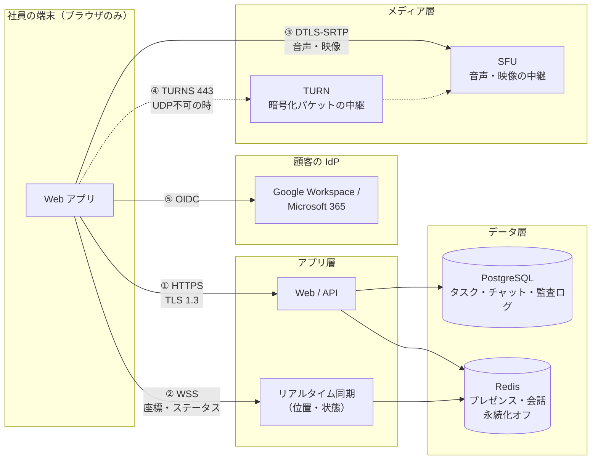
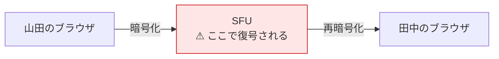
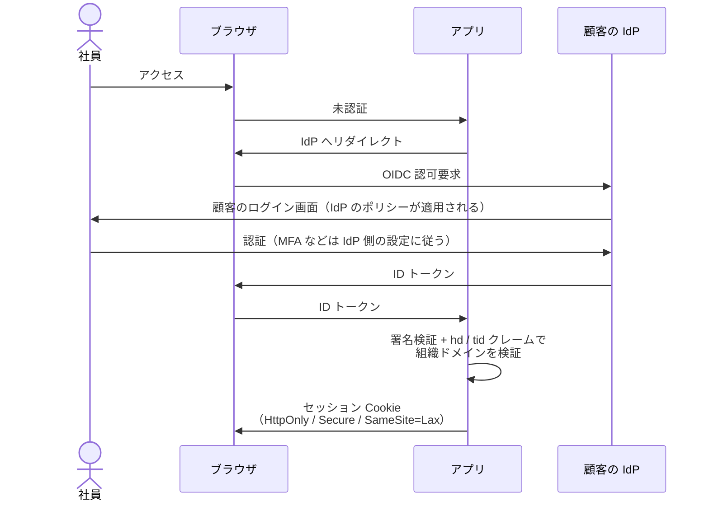

# 02. データフローと復号点

> 設計段階の記載（[README の注記](./README.md)）。

**セキュリティ担当が一番知りたいのは「どこで誰が中身を見られるか」である。**
経路ごとに1つずつ答える。詳細な根拠は [07. 接続の安全性](../design/07-security.md)。

---

## 1. 全体のデータフロー

---

## 2. 経路ごとの復号点

| 経路 | 保護 | **中身を見られる者** |
| --- | --- | --- |
| ① HTTPS | TLS 1.3 | アプリサーバ（タスク・チャットを扱うため当然） |
| ② WSS | TLS | リアルタイム同期サーバ。ただし**見えるのは座標とステータスだけ**。会話の中身ではない |
| ③ SFU（E2EE なし） | DTLS-SRTP | **SFU が復号できる** ← 唯一の弱点 |
| ③ SFU（**E2EE あり**） | DTLS-SRTP + フレーム暗号 | **誰も見られない** |
| ④ TURN | TLS + DTLS-SRTP | **誰も見られない**（§3） |
| ⑤ OIDC | TLS | 顧客の IdP（顧客自身） |

---

## 3. よくある誤解: 「TURN を経由すると中身を見られる」

**見られない。**

WebRTC のメディアは **DTLS-SRTP** で保護されており、
鍵交換と暗号化・復号は**端点（ブラウザ）でのみ**行われる。
TURN サーバは暗号化されたパケットをそのまま中継するだけで、鍵を持たない。

さらに、DTLS-SRTP の鍵素材は **JavaScript からも取り出せない**（ブラウザ内部が保持する）。
アプリのコードが漏れても鍵は漏れない。

→ **[01 §1.2](./01-endpoints.md) の TURN フォールバックは、安全性を落とさない。**
落ちるのは遅延と帯域効率だけである。

---

## 4. 唯一の弱点: SFU

グループ通話のために SFU を経由する構成では、**暗号化が SFU で一度終端する**。
SFU が受信ストリームを復号し、再暗号化して転送する。

これは本プロダクト固有の問題ではなく、**SFU 方式そのものの性質**である。
Zoom も Gather も、SFU/MCU を使う限り原理的に同じ構造を持つ。

### これに3つ重ねる

| # | 対策 | 効果 |
| --- | --- | --- |
| 1 | **音声は E2EE を既定 ON** | SFU も復号できない。日常の会話はすべて E2EE になる |
| 2 | **セルフホスト** | 復号するのが顧客自身のサーバになり、「社外の誰か」が消える |
| 3 | **プライベートルームは E2EE 強制** | 解除不可 |

### E2EE を既定にできる理由

E2EE を有効にすると、SFU は中身を読めないため次ができなくなる。

| E2EE で失う機能 | 本プロダクトへの影響 |
| --- | --- |
| サーバサイド録画 | **影響なし。作らない** |
| サーバサイド文字起こし | **影響なし。作らない** |
| MCU（サーバ側の映像合成） | **影響なし。クライアント側でレイアウトする** |
| simulcast のレイヤー切替 | **影響あり（映像のみ）。音声には影響しない** |

> **「録画しない・文字起こししない」という [00 原則3](../design/00-overview.md) 由来の判断が、
> E2EE の代償をほぼ帳消しにしている。**
> 一般的なビデオ会議 SaaS が E2EE を既定にできないのは、これらを売りにしているからである。

**よって**:

| 対象 | E2EE |
| --- | --- |
| 音声（既定・常用） | **常に ON** |
| プライベートルーム | **常に ON（強制・解除不可）** |
| 通常の会議室の映像 | 組織設定で選択（既定 ON） |

---

## 5. P2P にしていないことの副作用（プライバシー上の利点）

素の P2P（メッシュ）では、ICE の過程で**相手に自分のグローバル IP が渡る**。
在宅勤務なら、**自宅の IP アドレスが同僚に見える**ということである。

本プロダクトは SFU 方式なので、各クライアントの ICE 候補は SFU（または TURN）に解決される。
**参加者同士は互いの IP を知らない。**

N² 問題を避けるために選んだ SFU が、そのままプライバシー対策になっている。

---

## 6. プライベートルームの秘匿

「UI で隠している」のではないことを明示する。

- プライベートルームは**独立した SFU room**
- 非参加者には**トークンが発行されない** → SFU が非参加者にストリームを送る経路が**存在しない**
- フロア上の表示も、サーバが送るデータの時点で落とす
- **「クライアントには届いているが CSS で隠している」という実装は禁止**（実装規約）

在室者の可視性は3段階で設定できる。

| 設定 | 外から見えるもの |
| --- | --- |
| `FULL` | 誰がいるか見える |
| `OCCUPIED` | 「使用中」とだけ見える |
| `HIDDEN` | 何も見えない |

---

## 7. 認証フロー

- **パスワードを持たない。** 認証はすべて顧客の IdP に委ねる
- MFA、パスワードポリシー、条件付きアクセスは**顧客の IdP 設定がそのまま効く**
- `hd`（Google）/ `tid`（Microsoft）で**組織ドメインを検証**するため、
  ドメイン外のアカウントは入れない
- トークンは `localStorage` に置かない（メモリ保持のみ）

---

## 8. 端末に残るもの

| 保存先 | 内容 | 消し方 |
| --- | --- | --- |
| Cookie | セッション（HttpOnly） | ログアウト / ブラウザのデータ削除 |
| `localStorage` | 表示設定（表示モード、軽量モードの選択）、端末内の識別子 | ブラウザのデータ削除 |
| メモリのみ | SFU の room トークン | タブを閉じれば消える |

- **端末にファイルを書かない**（ダウンロードを除く）
- キャッシュされるのはアプリのアセット（JS / CSS / 3Dモデル）のみ。**業務データはキャッシュしない**
